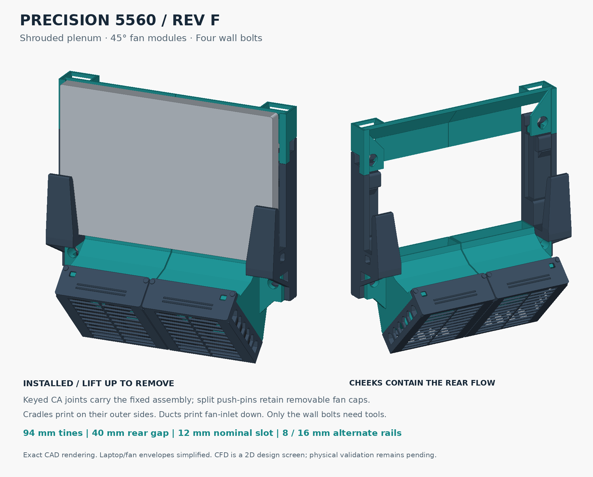
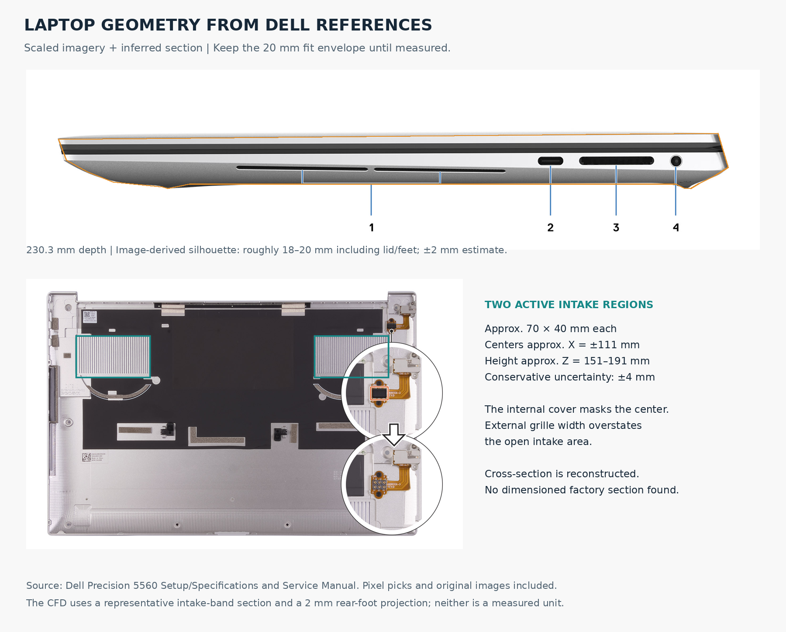
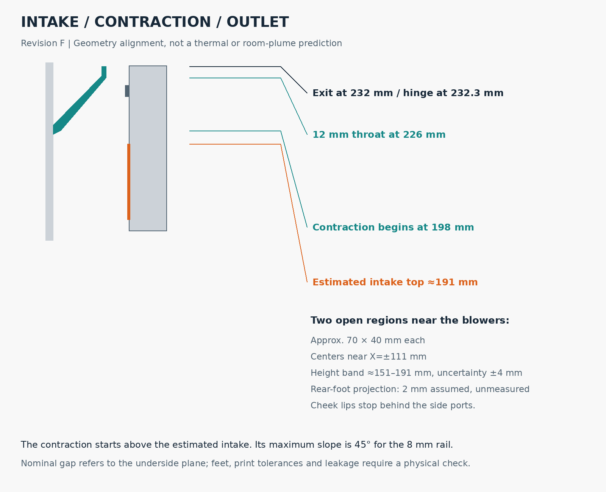
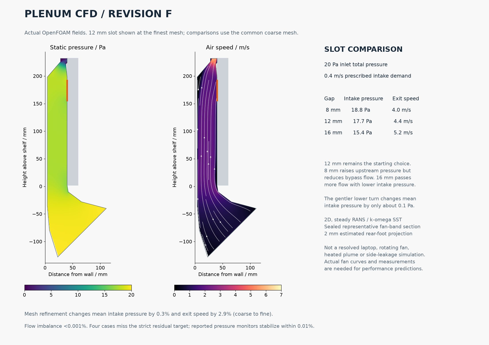
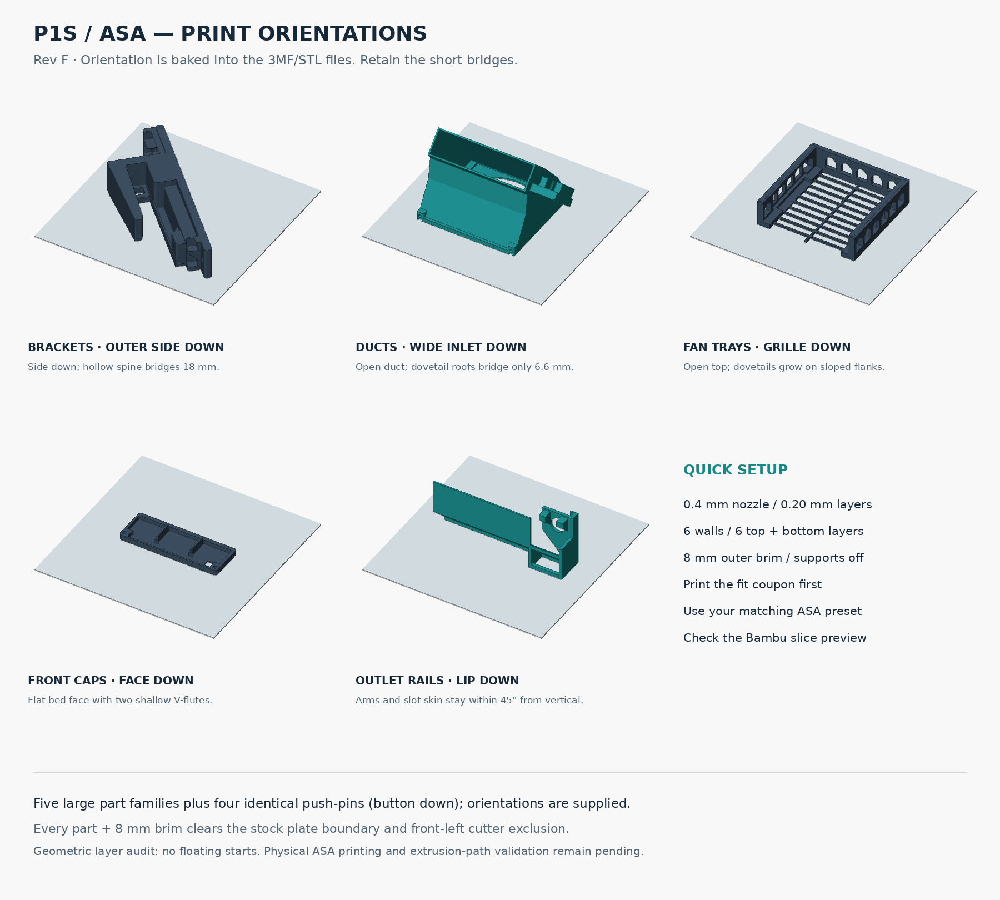
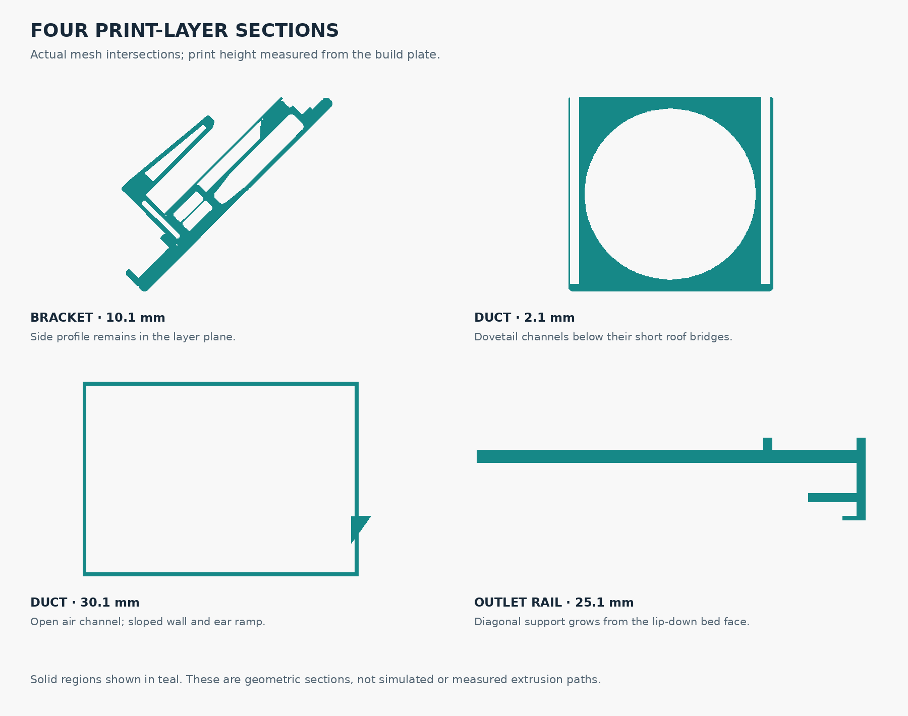
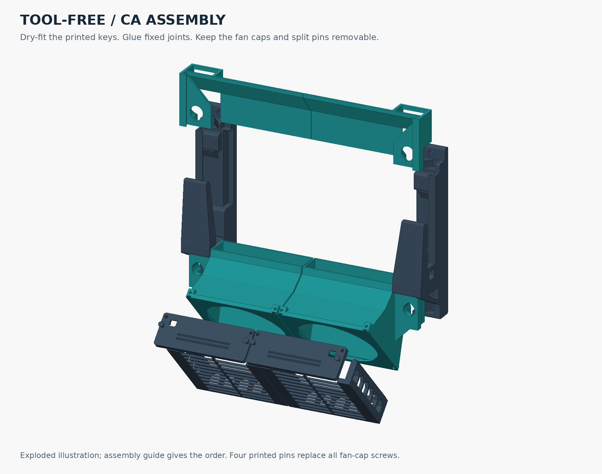

# Precision 5560 server wall mount — engineering report

Revision F · 7 September 2026 · design and numerical checkpoint

**The current design is ready for prototype fit and print evaluation.** It combines a removable laptop cradle, an inclined two-fan plenum, a restricted upper outlet, and keyed assembly with four wall bolts. Geometry checks and a limited structural screen support this checkpoint. Physical printing, adhesive retention, pin durability and cooling performance remain unverified.

## 1. Design basis

The mount stores a closed Dell Precision 5560 used as a web server. The hinge faces up so the exhaust remains at the upper edge. The laptop's underside faces the wall and a fan-fed gap. The user can lift the laptop out for temporary keyboard access without dismantling the mount.

| Parameter | Revision F |
|---|---|
| Laptop reference envelope | 344.4 × 230.3 × 20 mm |
| Bare retention slot / front tine height | 26 / 94 mm |
| Nominal underside-to-wall gap | 40 mm |
| Fans | Two 120 mm frames, 25–27 mm thick |
| Fan airflow direction | Wallward and upward at 45° |
| Wall attachment | Four Ø7 mm holes; axes normal to wall |
| Hole centers | X = ±162 mm; Z = −36 and +174 mm |
| Tool clearance | Ø16 mm room-side corridors |
| Default outlet / alternatives | 12 mm / 8 and 16 mm |
| Printed assembly | 14 pieces, including four identical split pins |
| Laptop removal | 105 mm lift, then forward; allow 110 mm overhead |

Coordinates are X across the laptop, Y outward from the wall and Z upward in the exported assembly. Inspect the installed-reference STEP when positioning the mount. Physical measurements should resolve the stated profile uncertainty before permanent assembly.

## 2. Reference geometry and vent alignment

Dell's published width and depth set the image scales. Manual pixel picks from the side view reconstruct a conservative silhouette. The inside-base-cover image reveals two active intake regions behind the broad exterior grille. The covered center matters: treating the entire exterior grille as an open intake would misrepresent the flow path.

We observed the following:

- The scaled inside-cover image places two approximately 70 × 40 mm intake regions near X = ±111 mm and Z ≈151–191 mm.
- The image-derived intake location carries an estimated ±4 mm uncertainty.
- The reconstructed side profile carries an estimated ±2 mm uncertainty. The assembly retains a 20 mm thickness envelope.
- The model assumes a 2 mm rear-foot projection. No dimensioned factory cross-section or physical measurement establishes that value.

The contraction begins at Z = 198 mm, above the estimated intake band. It reaches its throat at Z = 226 mm and exits at Z = 232 mm, close to the hinge edge at Z = 232.3 mm. These locations retain a nominal gap between the intake and contraction; they require verification on the actual machine.

The [profile JSON](profile_reconstruction.json) preserves pixel picks, scale factors, source hashes and uncertainty. The [reference STEP](REFERENCE_Estimated_Laptop_Profile.step) is an inferred silhouette, not manufacturer geometry. Source links appear in [SOURCES.md](SOURCES.md).

## 3. Airflow design and numerical evidence

The lower fans feed a rear plenum. Cheeks reduce gross side escape, and the upper restriction provides resistance downstream of the intake band. This arrangement aims to retain static pressure near the laptop's intake while directing bypass air upward. It does not require tilting the laptop or sealing it into a pressure vessel.

Pressure and flow must be considered together. Restricting an outlet can increase upstream pressure while reducing total flow; a narrower opening does not guarantee a faster jet when the fan's available pressure is limited. The laptop's own blowers and resistance also determine through-laptop flow.

Eight OpenFOAM v1912 `simpleFoam` runs use steady incompressible RANS with k–omega SST. The domain is a representative sealed 2D fan-band section with a 1 mm empty extrusion. Nominal inlet total pressure is 20 Pa; the outlet uses zero-gauge static pressure. The intake patch has a prescribed 0.4 m/s demand. Sensitivity cases use 10 Pa supply and 0.8 m/s intake demand.

| Common-mesh case | Mean intake pressure, Pa | Mean slot exit speed, m/s |
|---|---:|---:|
| Curved lower turn, 8 mm slot | 18.80 | 4.01 |
| Curved lower turn, 12 mm slot | 17.67 | 4.42 |
| Curved lower turn, 16 mm slot | 15.43 | 5.16 |
| Straight lower turn, 12 mm slot | 17.56 | 4.39 |

The 12 mm slot remains the first prototype configuration. The 8 mm variant retains more modeled intake pressure but passes less bypass flow and leaves less clearance. The 16 mm variant passes more flow at lower intake pressure. The gentler turn changes mean intake pressure by only about 0.11 Pa on the common mesh; that result does not establish a meaningfully optimized bend.

All eight meshes passed `checkMesh`, and reported flow imbalance stays below 0.001%. Coarse-to-fine refinement changes mean intake pressure by about 0.3% and exit speed by about 2.9%. Four cases miss the strict residual target at 1,600 iterations even though the final mean-pressure monitors change by less than 0.01% between saved states. The [CFD report](CFD_Design_Report.md) identifies every case and preserves the boundary conditions and convergence limits.

**Interpretation limit:** the intake flow is imposed, not predicted from a laptop resistance model. The supply pressure is assumed, not derived from the selected fan's pressure–flow curve. The study omits 3D side leakage, fan hubs and swirl, detailed grilles and ribs, internal laptop flow, heat transfer and the room plume. It cannot establish actual total CFM, cooling improvement or how far hot air travels above the machine. Positive modeled pressure supports the arrangement as a prototype hypothesis, not a guaranteed operating result.

## 4. Material reduction and structure

The design replaces bulky regions with hollow box sections, thin duct skins, framed fan trays and pocketed caps. It retains material at the saddle roots, bearing shoulders, wall holes and load-carrying bracket sections. This is deliberate geometry reduction informed by calculations; no generative solver or topology-optimization algorithm was run.

| Checkpoint | Solid CAD volume, cm³ | Interpretation |
|---|---:|---|
| Revision D | 1,810.4 | Earlier reference |
| Revision E | 1,164.2 | Lightweight baseline |
| Revision F | 1,177.3 | Shrouded, inclined, CA/pin assembly |

Revision F reduces solid volume by 35.0% relative to D. The latest containment and assembly changes add 13.1 cm³ relative to E, approximately 14 g at the assumed ASA density of 1.07 g/cm³. These comparisons use equal fill policy and exclude brims and process allowances; they are not slicer filament estimates.

The structural screen uses a 2.5 kg laptop, a 6 kg complete installation, a 1 kg allowance per fan module, 3g acceleration and a 50 N outward hinge pull. It adopts 5 MPa normal/bearing and 2 MPa shear limits, a 1,000 MPa effective modulus, a 1.5 local stress multiplier and a 10% section-property allowance. These are chosen screening values, not measured warm printed ASA properties.

Net section properties come from the actual cradle geometry at 0.5 mm stations and include voids and unsymmetric bending. The rear-section calculation ignores the additional cheek stiffness. The minimum assumed-limit-to-demand ratio is **1.19**, governed by the combined rear-rail screen. It is not a tested assembly safety factor. The full [strength report](Strength_and_Installation_Check.md) lists each calculation and load demand.

The calculations do not resolve adhesive peel and pullout, pin retention, anchor capacity in the actual wall, torsion, local buckling, fatigue, impact or long-term thermal creep. In particular, each duct has a calculated 47.8 N outward joint demand and each pin a 7.4 N retention demand that still require physical qualification.

## 5. FDM design and assembly

The cradles print on their outer sides to place the main bracket load path within the layer planes. The ducts print from their inclined fan-inlet faces, and the outlet rails print lip down. Sloped joint roofs and skins avoid broad unsupported ceilings. Deliberate short bridges close hollow sections without filling them with support.

All individual parts, including an 8 mm brim, fit the P1S's 256 mm bed while avoiding the stock front-left cutter exclusion. The 0.20 mm geometric layer audit finds no floating starts. The largest intentional bridge spans 18 mm in the rear spine; its maximum sampled unsupported reach is 8.8 mm. Dovetail roofs span 6.6 mm. These checks evaluate geometric support, not extrusion quality.

The Bambu Studio runtime could not execute in the design environment. The files have therefore not passed an actual Bambu toolpath preview or print trial. The [ASA guide](P1S_ASA_Print_Guide.md) provides starting process settings and highlights the required preview.

Fixed ducts and rails use keyed lap joints. Their shoulders carry vertical reactions; CA retains withdrawal. The fan trays slide into dovetails, and two split pins retain each fan cap. The assembly needs no M3/M4 screws, nuts or heat-set inserts. All four wall bolts remain perpendicular to the wall with clear tool access.

The nominal sliding allowance is 0.30 mm horizontally per side, with 0.30 mm crown and 0.20 mm root clearance. The keyed CA pockets use 0.30 mm nominal offsets plus roof relief. Split pins use a 4.0 mm shaft, 4.1 mm socket and 4.2 mm retaining crown. [TOLERANCES.md](TOLERANCES.md) distinguishes diametral, radial and coordinate allowances; no global shrink compensation is assumed.

## 6. Verification record and next decisions

| Evidence completed | Practical limit |
|---|---|
| 14 valid solids; STEP reimport | Solid validity does not establish manufacturability |
| Fit, service motion and driver-path checks | Laptop envelope and image-derived profile need physical confirmation |
| No unintended part overlap | Four pin crowns intentionally interfere by 0.05 mm radially |
| Watertight oriented meshes and bed/brim check | Slicer-generated extras and extrusion paths remain to be inspected |
| Geometric layer support audit | Bridges and surface quality need printing |
| Net-section strength screen | Bonds, anchors, retention and warm creep remain unqualified |
| Eight CFD cases with raw logs and fields | Comparative 2D study with prescribed laptop demand |

The next prototype should proceed in this order:

1. Measure the actual closed laptop, feet and intake boundaries. Confirm noncontact cheek and outlet clearance before choosing the rail pair.
2. Print the joint and pin coupons in the intended ASA process. Check sliding fit, CA retention and repeated pin use. Check long tray engagement for warping.
3. Preview the full parts in Bambu Studio, including bridge direction, extrusion continuity and brim placement. Print and inspect the structural brackets before loading the laptop.
4. Qualify the assembled joints and wall attachment against the stated demands, then assess deformation and creep at the measured operating temperature.
5. Fit the selected fans, measure plenum pressure near both intake regions, and compare repeatable workload temperatures and noise with fans off/on and alternative outlet rails. Record ambient temperature, fan speed and laptop workload.
6. Use the measured fan curve, pressure, leakage and laptop response to decide whether a coupled 3D or thermal CFD model would change the design. Revisit material reduction only after the physical joint and creep behavior are established.

## 7. Reproducibility

[PROCESS.md](PROCESS.md) records the design decisions, ordered regeneration commands and evidence files. Raw CFD cases, saved fields and logs are under `cfd/`; scripts use paths relative to the repository. The repository excludes runtime binaries, private conversation transcripts and nested historical archives. Manufacturer PDFs remain available at the attributed source links.
