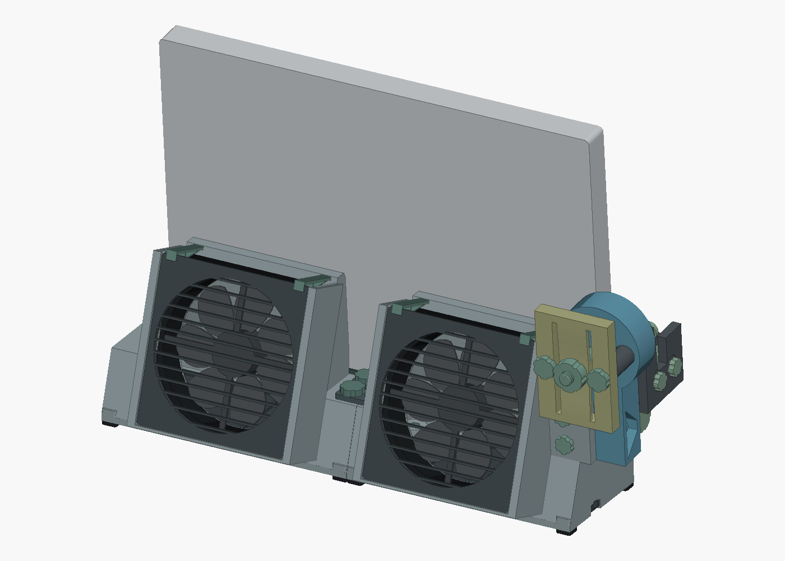

# Precision 5680 desk dock

A compact, hinge-down stand built around its cooling plenum. Two recessed fans draw from the laptop's hinge exhaust, and a captured USB-C plug makes the final sideways docking connection.

**17 September checkpoint:** the V4 full-height A/B/C fit kit (filed locally) is toolpath-verified and ready for a supported contact test. The reported seating failure remains unresolved. **D9 is unfinished**: its diagnostic duct failed enclosure/print geometry, and the next panel construction exists only as a plan. No D9 airflow or acoustic improvement has been demonstrated.

**[Handoff, evidence and ordered next steps](https://thereprocase.github.io/5680-dock/handoff-2026-09-17.html)** · [Detailed next-step list](docs/handoff/2026-09-17/NEXT-STEPS.md)

D8 remains the last complete CAD reference. The earlier nominal CAD/manufacturing checks below do not establish physical seating, strength or cooling.

**[Explore D8](https://thereprocase.github.io/5680-dock/)** · **[Download D8 STEP](docs/downloads/Precision_5680_D8_STEP.zip)** · **[Print + source package](docs/downloads/Precision_5680_D8_Review.zip)** · **[Assembly and adjustment](desk-dock/D8/README.md)** · **[P1S print guide](desk-dock/D8/PRINT_DESIGN.md)**

## Form follows the load and the print

- **Removable connector module.** A keyed shoe and two accessible hand screws secure the complete mechanism. The cable cradle slides ±3 mm in Y, the saddle slides −4/+5 mm in Z, and an independent stop sets the laptop's X position. Adjust the existing parts directly.
- **Gravity through the shell feet.** Perimeter walls and dedicated feet carry the laptop. Bottom covers provide service access and clear the structural feet.
- **Lighter covers.** A 2 mm skin, perimeter ribs and compact fastening bosses reduce the two covers from about 180 g to 94 g of PETG—approximately 48% less plastic.
- **Serviceable fans.** Two nominal 120 × 120 × 25 mm fans sit behind flat slide-in grilles and replaceable clips. Documented clearances accommodate the researched frame sizes; a perimeter gasket is optional.
- **Deliberate print orientations.** All 43 manufacturing meshes specify a bed face and explain the layer-strength tradeoffs. Flat grilles and in-plane flexures print separately; shell ribs and underside ramps provide bridge landings and reduce overhangs.

The laptop retains its 5° lean, and the fans discharge 18° above the desk. The resettable face-cam hinge and printed preload spring remain. Their measured release force and warm creep still need testing.

## Plastic and print preparation

The starting process is **P1S, PETG, 0.4 mm nozzle, 0.20 mm layers, five walls and six top/bottom layers**, with dense loaded mechanism parts. Use OrcaSlicer for the actual printer setup.

| Material estimate | PETG |
|---|---:|
| Finished CAD solid volume | 1.243 kg |
| Generic slice, including normal supports and individual brims | **1.659 kg** |
| First-build allowance, including some samples and reprints | **1.8–2.0 kg** |

The generic offline Cura screen estimates about 380 g of support and 25 g of brims at 1.27 g/cm³ PETG. Flexible contacts and startup waste are additional. These are planning figures; the final P1S profile controls actual use. Shell supports remain the largest print optimization opportunity. A reduced-support trial produced long roads in the wrong bridge direction, so its smaller material estimate was rejected.

## What the checks establish

All **83 assembly solids** pass CAD validity checks, with no unintended nominal rigid collisions. All **43 print meshes** are watertight and fit the recorded P1S envelope with an 8 mm brim. The 12 sampled laptop docking/withdrawal positions and listed module/cover service positions pass their clearance checks.

These checks do not establish physical strength or an approved P1S print job. Print fit samples first, inspect bridge direction and support removal, then test the complete holder. The ≤0.20 mm deflection at 20 N and nominal 50 N release remain test targets. See the [current results and remaining work](desk-dock/D8/CURRENT_STATUS.md).

## Build, inspect, continue

| Start here | What it contains |
|---|---|
| [D8 source and assembly](desk-dock/D8/README.md) | Editable CAD, adjustment and service instructions, regeneration commands |
| [Print design](desk-dock/D8/PRINT_DESIGN.md) | P1S process assumptions, every orientation and remaining support checks |
| [Print manifest](desk-dock/D8/print-manifest.json) | Per-part geometry, material, pose and mesh records |
| [Fan fit](desk-dock/D8/FAN_FIT.md) | Manufacturer dimensions, tolerances and clip allowance |
| [Generation provenance](desk-dock/D8/generation-provenance.json) | Source and export hashes tying the files to the checks |
| [Project context](PROJECT_CONTEXT.md) | Design decisions, coordinates, history and continuing work |

The STEP download is a lossless ZIP containing the complete CAD file. Individual STLs already use their manufacturing orientations. The source remains editable in CadQuery.

## Earlier revisions

The [archived D7 viewer](https://thereprocase.github.io/5680-dock/desk-dock-d7.html) and its [review archive](docs/downloads/Precision_5680_D7_Review.zip), earlier desk-dock studies and [original 5560 wall-mount overview](docs/history/5560-README.md) remain available as history. Use the D8 files above for current work. See [LICENSE](LICENSE).
