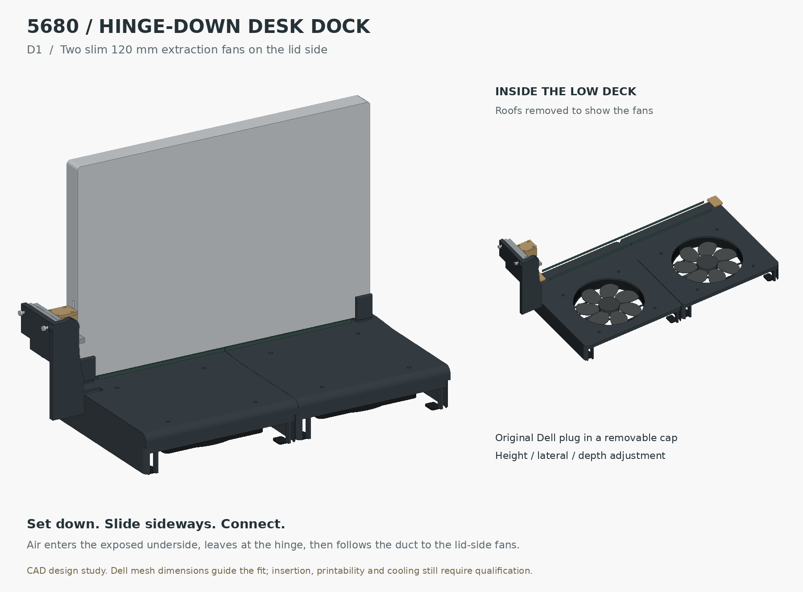
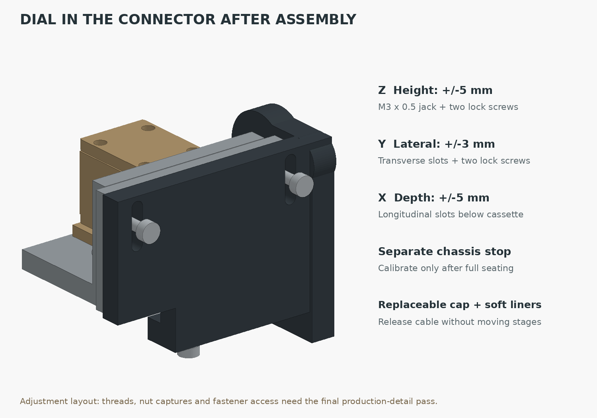
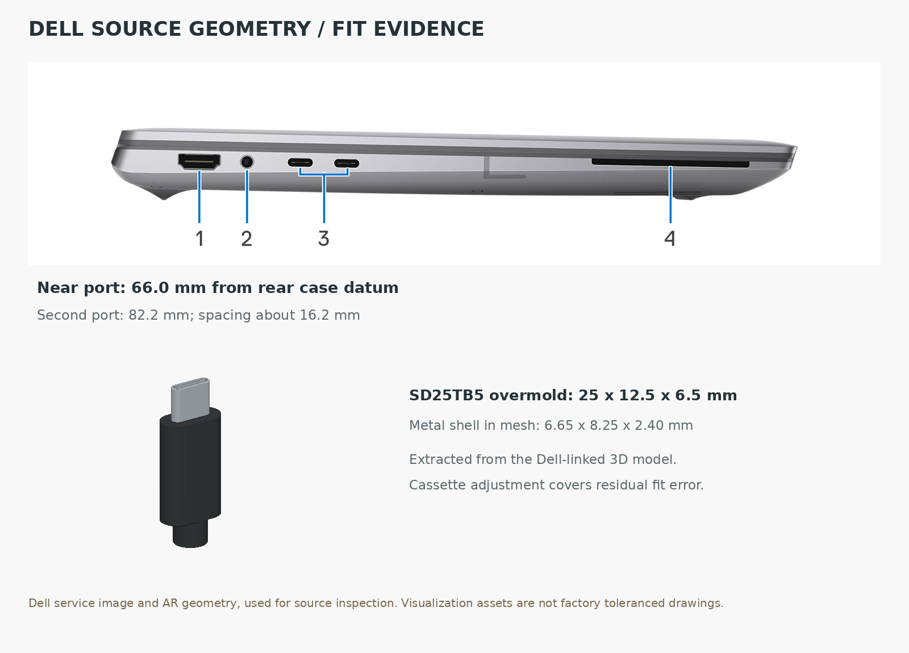
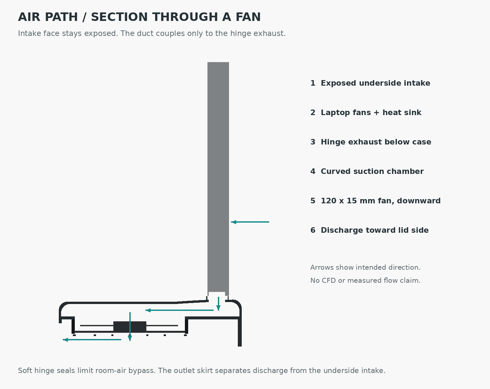

# Precision 5680 / hinge-down extraction dock

[STEP review package](Precision_5680_D1_Review.zip) · [Connector adjustment](adjustment.png) · [Air-path section](air-path.png) · [Source geometry](reference-evidence.png)



Set the closed laptop into the corner bearings, **hinge down**, then slide it
sideways into the captured SD25TB5 plug. Two slim 120 mm fans lie flat on the
**lid side**, pulling from a duct that curves underneath the hinge. The broad
underside intake remains exposed. A skirt directs the fan discharge toward the
lid side along the desk.

The main deck reaches **50 mm above the desk**. The rear-case bearing datum
sits at 54 mm; the selected port center sits at about 120 mm. The small plug
support tops out at 135 mm, only 81 mm above the rear-case datum. The modeled
overall footprint is approximately 406 × 188 mm, including the plug support.
The fan housings add useful desk bearing width on the lid side.

**D1 is a developed CAD study, not a print release.** The actual duct passage,
mounting bores, adjustment clearances and separate load stop are modeled.
Fastener/nut retention, all attachment details, strain relief, liner compression,
automatic lift protection and physical thermal/fit qualification remain open.

## Fine adjustment after assembly



| Axis | Adjustment | How it stays put |
|---|---|---|
| Z: port height | M3 × 0.5 jack, ±5 mm; 1 turn = 0.5 mm | Two independent face clamp screws |
| Y: position across laptop thickness | Transverse slots, ±3 mm | Two independent clamp screws |
| X: engagement depth | Longitudinal cassette slots, ±5 mm | Two screws through the bottom shelf |
| Laptop travel limit | Independent M4 chassis stop | Locknut; soft contact tip |
| Plug replacement | Removable cap | Carrier settings remain fixed |

The adjustment range is for setup; the stages lock before everyday docking.
The cap holds replaceable compliant liners around the overmold. The modeled
rear shoulder bears on the transition to the strain-relief neck. A proposed
0.8 mm metal face clip captures the front shoulder without requiring a thick
printed wall between the plug and laptop. Its fabrication and attachment need
detailing; its thickness must be included when setting full engagement.

An initial setup uses the actual laptop as the alignment jig: retract the
chassis stop, seat the laptop on its bearings, leave the stages just loose
enough to move, and engage the plug by hand. Set Z and Y without side load,
set X for normal full engagement, lock the stages, then bring the independent
stop to the chassis. Slide out and repeat before normal use. The USB-C shell
must never function as the bearing, alignment funnel or end stop.

The ±5 mm Z range targets the **nearer** Thunderbolt port. Using the second
port requires changing the nominal height by about 16.2 mm in the CAD; the
fine-adjustment range does not span both ports. Angular setup error is handled
by the compliant cassette liners and guide fit, not by claiming a rotary stage.

## What the online geometry established



Dell's product pages link actual glTF assets for their 3D/AR viewers. We
downloaded those, applied the laptop scene transforms, and extracted the
connector meshes. The laptop body width in the model is 353.680 mm, matching
the published width. These are visualization assets, not toleranced factory
drawings; the mechanical adjustments deliberately cover residual error.

| Feature | Extracted result | Basis |
|---|---:|---|
| Near left Thunderbolt center | 65.98 mm from rear **base-cover** datum | `Dell4768` transformed bounds |
| Other left Thunderbolt center | 82.19 mm from same datum | `Dell4694` transformed bounds |
| Port spacing | 16.21 mm | Difference between centers |
| SD25TB5 main overmold | Approximately 20 × 12.5 × 6.5 mm | `Cube_8`; excludes 5 mm neck |
| Overmold plus neck length | 25 mm | Full `Cube_8` bounds |
| Exposed metal shell | 6.65 × 8.25 × 2.40 mm | `Cube_9` bounds |

Scaling Dell's service side image against 240.33 mm depth independently gives
approximately 66.03 and 82.18 mm. That agreement supports the layout, but does
not turn the images into a production tolerance. The outer hinge lip projects
past the rear base-cover datum; bearing pads support the case corners and
leave the hinge/exhaust region relieved. The reference laptop remains a
simplified closed envelope rather than an exact manufacturer solid.

[Raw extraction record, source URLs and SHA-256 hashes](reference-extraction.json).
The extraction script records the vertex bounds and source image pixel picks.

## Suction below the hinge



The intended flow follows the laptop's existing forced ventilation direction:
room air enters the exposed underside grille, the internal blowers drive it
through the heat sink, and the external fans lower the pressure in the chamber
at the hinge exhaust. Hinge-down operation does not create a passive chimney;
this concept relies on the laptop's blowers and the powered extraction fans.
The service illustrations support this flow-path interpretation, but they do
not supply internal fan curves or quantify the chassis resistance.

The curved chamber covers the exhaust region only. Thin replaceable sealing
lips limit room-air bypass around the hinge. They carry no laptop bearing
load. The two chambers use one fan each, with the fan faces entirely on the
lid side. Their outlet skirts block direct discharge toward the intake face.

The dimensional baseline is two **Noctua NF-A12x15 PWM** fans: 120 × 120 × 15 mm,
105 mm hole spacing, 12 V. Noctua lists 55.44 CFM free-air flow and 1.53 mm H₂O
(about **15 Pa**) maximum static pressure per fan. Those are opposite endpoints,
not simultaneous performance. Two fans in parallel add available flow; they do
not double maximum pressure. The model uses generic rotor geometry and colors.
If retaining the manufacturer's vibration pads, allow the additional pad
thickness and set the fan-deck gasket accordingly.

At an **assumed** total 20 CFM, the roughly 5,000 mm² under-hinge opening would
carry about 1.9 m/s, with about 2.1 Pa velocity pressure. Losses through the
turn, grille, desk outlet and seal leakage consume part of the fan's small
pressure budget. This is a dimensional estimate, not a solved operating point.
For scale, a 0.5 mm equivalent gap around a 634 mm seal perimeter would bypass
about 1.8 CFM at an assumed 10 Pa suction (Cd 0.65; air density 1.2 kg/m³).
A 3 mm gap would bypass about 10.7 CFM under the same assumptions. A good hinge
interface matters more than adding unrestricted fan capacity.

Use a regulated 12 V supply and a PWM controller/splitter for the fan pair;
final harness routing and retention remain to be designed. Test one and both
fans off as well as normal operation: the duct must not worsen the baseline
when the external fans stop. No new CFD or measured cooling result is claimed.

## Checks completed and remaining work

- Each exported component is a valid solid, and the STEP reimports successfully.
- The rigid custom parts have no unintended intersections in the nominal CAD.
- The five principal adjustment parts clear one another at 27 sampled
  combinations of the specified X/Y/Z limits. The screen excludes the laptop,
  fastener head access and nut engagement; it does not prove precise insertion.
- The source images, plug mesh and rendered CAD views were inspected.

[Machine-readable validation](validation.json) · [Part geometry](geometry.json).
The two fan modules suit a segmented P1S build, but the left deck with its
integrated connector support still needs a build-orientation and bed review.
Use OrcaSlicer, the repository default, for the production detailing pass.

Next physical checks: align and lock the connector; verify engagement and
withdrawal without shell loads; test retention and accidental lift; qualify
the desk restraint and warm printed structure; measure chamber pressure and
laptop CPU/GPU temperatures/power at the same workload with the external fans
off, low and high. Until an interlock is detailed, disconnect sideways before
lifting. A fit coupon should precede the complete print.

## Sources

- [Dell Precision 5680 product page](https://www.dell.com/en-us/shop/dell-laptops/precision-5680-workstation/spd/precision-16-5680-laptop): published envelope and discovery of the [Dell-linked laptop mesh](https://content.hmxmedia.com/precision-16-5680-laptop-AR/gltf/precision-16-5680-laptop-AR.glb).
- [Dell 5680 left view](https://www.dell.com/support/manuals/de-ch/precision-16-5680-laptop/precision-5680-owners-manual/left?guid=guid-12cd14bb-8db3-47d7-a090-15d75787517a&lang=en-us): identifies the two Thunderbolt ports and supplies the side image.
- [Dell 5680 Owner's Manual](https://dl.dell.com/content/manual19946365-dell-precision-5680-owner-s-manual.pdf?language=en-us), pages 55 and 59: internal fan and heat-sink geometry; base-cover illustrations show the exposed intake grille and hinge region.
- [Dell SD25TB5 product page](https://www.dell.com/en-us/shop/dell-pro-thunderbolt-5-smart-dock-sd25tb5/apd/210-brqs/docks): discovery of the [Dell-linked dock/plug mesh](https://content.hmxmedia.com/dell-pro-sd25tb5-dock-AR/gltf/dell-pro-sd25tb5-dock-AR.glb).
- [Noctua NF-A12x15 PWM specifications](https://www.noctua.at/en/products/nf-a12x15-pwm/specifications): fan envelope, voltage and pressure/flow endpoints.

## Rebuild

Python 3.12, CadQuery 2.8, NumPy, Pillow and trimesh:

```bash
python desk-dock/D1/extract_references.py /tmp/dell5680-references
python desk-dock/D1/build.py
python desk-dock/D1/validate.py
```

`parameters.json` holds the design values. The source downloads stay outside
the deliverable; the repository retains the attributed inspection image and
dimension/hash record. D0 remains available through Git history.

## Revision brief

The user rejected D0's appearance and specified hinge down, a low profile,
two 120 mm fans that create suction below the hinge, and online reconstruction
of the required hardware geometry. They then placed the fans on the lid side
with a duct that curves below the machine and requested port fine adjustment
after fabrication. D1 implements that architecture and replaces D0 as the
current design study.
