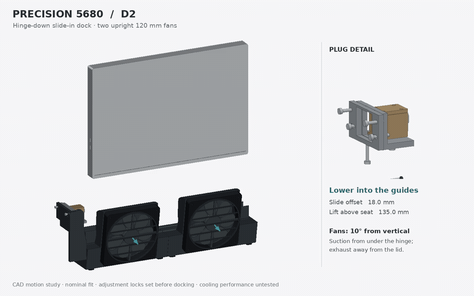

# Precision 5680 desk dock — D2



[Full-resolution MP4](docking-cycle.mp4) · [STEP and editable source package](Precision_5680_D2_Review.zip) · [Poster](overview.png)

Two 120 × 120 × 15 mm fans now stand **10° from vertical** on the lid side. Their suction faces connect to two curved pods fed by the low manifold beneath the hinge. Their discharge points away from the laptop, 10° down. The broad underside intake face stays exposed. The fan tops reach approximately 131 mm; the connector support reaches 135 mm. The laptop's rear-case bearing datum remains 54 mm above the desk, with the selected port center approximately 120 mm above the desk.

The animation uses the actual D2 CAD solids and fixed cameras. It shows lowering at an 18 mm lateral offset, sliding toward the original SD25TB5 plug, pausing docked, withdrawing 18 mm, then lifting. A synchronized close-up shows the connector approach. The 135 mm lift is a presentation distance, not a required docking stroke. Arrows indicate intended discharge direction, not measured airflow.

The hinge corner bearings are longer so both ends stay supported throughout the 18 mm slide. The inherited connector shelf was shortened to remove an interference found during the docking-path check. The original cable overmold remains captured by a removable cap and front clip. Independent depth, transverse and height adjustments retain the D1 nominal ranges: ±5, ±3 and ±5 mm. Set and lock these before docking; the separate chassis stop controls final travel. Only the nominal adjustment setting is animated.

## Evidence and limits

Dimensions and selected port location retain the [D1 Dell reference extraction](../D1/README.md) and [reference evidence](../D1/reference-evidence.png). These come from Dell-linked visualization assets and service images, not toleranced manufacturing CAD. Laptop and cable bodies are simplified envelopes. The dock electronics remain external; this design captures its host cable plug.

`validation.json` records a changed-geometry screen: individual solid validity, STEP round-trip validity, stationary custom-part and fan-envelope intersections, and 12 laptop positions through the nominal lower/slide path. Intentional internal overlaps among the schematic fan components are excluded. This is sampled envelope screening, not a continuous swept-volume or physical mating qualification.

**CAD motion study, not a print release.** Fan mounting fasteners, guard attachment, split-manifold joinery, seals, cable strain relief, anti-tip behavior, printed fits and load testing still need production detailing. Actual full USB-C engagement must be calibrated on the hardware without using the connector as a structural stop. Air leakage, fan/system operating point and temperature benefit have not been tested. D1 adjustment-range screening is historical evidence; the complete D2 adjustment sweep has not been requalified.

## Reproduce

With Python, CadQuery 2.8, NumPy, Pillow and ffmpeg installed:

```sh
python build.py
python validate.py
python animate.py
```

`animate.py` writes 114 frames at 12 fps (9.5 seconds), a full-resolution 1440 × 900 MP4 and a looping 960 × 600 GIF. The review archive contains the STEP, parameters, CAD and rendering sources, validation results and poster. Animation files are linked separately. Use OrcaSlicer for subsequent print preparation, per repository guidance.
