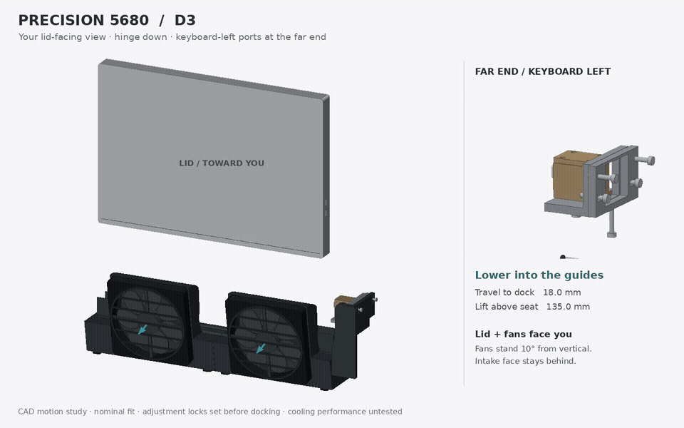

# Precision 5680 desk dock — D3

**Superseded by [D4](../D4/README.md):** retains this orientation, reverses the fan lean to 15° upward exhaust, and enlarges the rounded air passages.

D3 corrects the laptop handedness to match the supplied desk photograph. The laptop sits to the user's left, hinge down, with its lid facing the user. Its **keyboard-left ports sit at the far end: the right edge in the lid-facing photograph.** D1 and D2 placed that edge on the wrong end.



[Full-resolution MP4](docking-cycle.mp4) · [STEP and editable source package](Precision_5680_D3_Review.zip) · [Poster](overview.png)

## Orientation and movement

| Feature | Correct placement |
|---|---|
| Hinge | Down, in the trough |
| Lid | Toward the seated user |
| Underside intake grille | Behind the laptop, opposite the user and fans |
| Two 120 mm fans | Lid/user side, 10° from vertical |
| Keyboard-left Thunderbolt ports | Far end; photo right |
| SD25TB5 host cable clamp | Beyond that far edge, pointing back into the laptop |
| Dock | Lower into the guides, then slide toward the far plug |
| Undock | Withdraw toward the near end, then lift |

The exported CAD uses +X toward the far/plug end, +Y toward the lid/user/fans, and +Z upward. The near laptop edge is x=0; the far edge is x=353.68 mm. Docking moves the laptop from x-offset −18 mm to 0; removal reverses this. The 135 mm lift in the animation illustrates removal and is not a required docking stroke.

D3 reflects the actual CAD solids across the laptop's mid-width plane, including the port openings, plug, adjustment stages, chassis stop, extended bearings and ducts. It does not merely reverse the animation camera. `build.py` explicitly separates the inherited D2 construction coordinates from the corrected exported frame. The two fan centers remain symmetric; the cable support moves to the far end.

## Retained design

The rear-case bearing datum stays 54 mm above the desk. The selected port center stays approximately 120 mm above the desk. Two curved suction pods connect the under-hinge manifold to the near-vertical fans, which discharge toward the lid/user side, 10° down. The underside intake remains exposed. The plug retains independent depth, transverse and height adjustments, with nominal ranges ±5, ±3 and ±5 mm, and an independent chassis stop. Lock the adjustments before docking.

The supplied photograph establishes orientation, not scale. Laptop and plug dimensions retain the [Dell-linked D1 reference extraction](../D1/README.md) and [geometry evidence](../D1/reference-evidence.png). The laptop and cable remain simplified reference envelopes; the dock electronics remain external.

## Verification and limits

The geometry check verifies both far-edge port voids, corresponding solid near-edge locations, the far-side plug shell, and fan positions on the lid side. This checks the handedness separately from collision screening: a mirrored model can pass ordinary clearance checks.

The corrected assembly contains 53 valid solids and survives STEP export/import. Custom rigid parts and fan envelopes have no detected nominal intersections. Twelve sampled laptop positions along the corrected lower/slide path have no detected collisions. `validation.json` records these results. Intentional overlaps within schematic fan references are excluded.

**CAD motion study, not a print release.** Physical USB-C engagement, complete adjustment travel, fan and guard attachment, manifold joinery, seals, cable strain relief, stability, printed fits and loads still need qualification. Intended airflow arrows do not establish cooling benefit. The supplied desk photograph is not included in the repository.

## Reproduce

Use Python with CadQuery 2.8, NumPy, Pillow and ffmpeg:

```sh
python build.py
python validate.py
python animate.py
```

The animation runs 9.5 seconds at 12 fps. The MP4 is 1440 × 900; the looping GIF is 960 × 600. The review archive includes the STEP, source, parameters, validation, report and poster; animations are separate. Use OrcaSlicer for subsequent print preparation.
