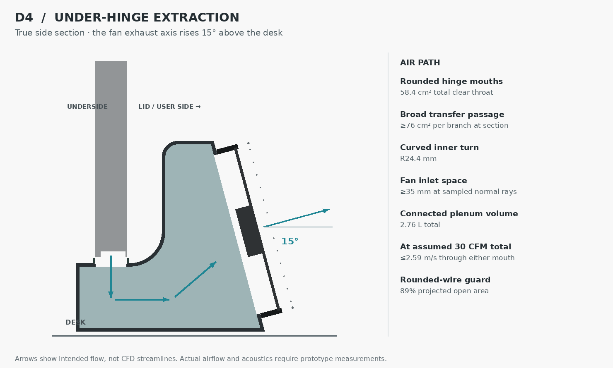

# Precision 5680 desk dock — D4

The fans now exhaust **15° above the desk**, with their tops leaning toward the laptop. D4 also enlarges the plenum, widens and rounds the hinge openings, and replaces the close flat guard with a spaced rounded-wire guard. The corrected orientation remains: hinge down, lid and fans toward the user, keyboard-left ports at the far end (photo right).



[Docking animation](docking-cycle.gif) · [Full-resolution MP4](docking-cycle.mp4) · [STEP and source package](Precision_5680_D4_Review.zip) · [Installed view](overview.png)

## Air passage sizing

**Design basis: 30 CFM total**, assuming 15 CFM per fan. This is a sizing target, not a measured or predicted operating point. The table reports dimensions from the CAD and the smaller branch where branches differ.

| Feature | D4 geometry / screen |
|---|---:|
| Total connected cavity volume, both independent branches | 2.76 L |
| Hinge throat clear area | 5,840 mm² total |
| Individual mouths | 130.84 × 21 and 148.54 × 21 mm |
| Mouth corner / edge radii | R4 / R1 mm |
| Transfer section at y=15 mm | 7,566 / 8,312 mm² |
| Inner curved turn | R24.4 mm |
| Fan inlet axial clear space | 57 mm |
| Minimum inlet clear space across 81 sampled normal rays per fan | 35 mm |
| Fan aperture | Ø113 mm, rounded R1 at wall edges |
| Guard wire / pitch | Ø1 / 9 mm, 8 mm gaps |
| Guard plane beyond discharge face | 7.5 mm |
| Guard projected open area within fan aperture | 88.8% |
| Hinge bearing datum above desk | 54 mm, retained |
| Fan-pod height | 134 mm |

The wider plenum adds depth on the desk rather than lifting the laptop. The two cavities remain separate and each connects its hinge mouth to one fan. The 21 mm opening fits beneath the closed laptop envelope; replaceable soft lips flank it. The broad intake grille stays exposed behind the laptop. Gaskets and seam sealing must prevent narrow bypass jets and leakage that would divert suction from the hinge.

## Flow and pressure screen

We use continuity, `v = Q/A`, and local velocity pressure, `q = ρv²/2`, with air density 1.2 kg/m³. Each branch receives half the assumed total flow. The smaller branch governs.

| Assumed total flow | Maximum mouth velocity | Estimated external duct loss, smaller branch |
|---|---:|---:|
| 20 CFM | 1.73 m/s | 1.4–3.4 Pa |
| 30 CFM | 2.59 m/s | 3.2–7.6 Pa |
| 40 CFM | 3.45 m/s | 5.7–13.5 Pa |

Loss estimates combine assumed entrance, slot-jet mixing, turn, roughness, guard and discharge terms. `airflow.py` records their reference areas and sensitivity coefficients; `airflow-sizing.json` records the geometry and results. These bounds are engineering assumptions, not coefficients calibrated to this enclosure. They exclude the laptop grille, heat sinks, internal blowers and seal leakage.

The [Noctua NF-A12x15 PWM](https://www.noctua.at/en/products/nf-a12x15-pwm/specifications) lists 55.44 CFM maximum free-air flow and approximately 15 Pa maximum static pressure. Those are separate endpoints. Two parallel fans do not double the available pressure, and the 15 Pa endpoint does not establish pressure available at our target flow. Without a fan/system curve intersection or prototype measurements, the model cannot confirm 30 CFM. The 40 CFM case shows why simply running harder can consume most of the available pressure and increase noise.

## Noise provisions

The design uses broad openings with rounded corners and rolled edge radii, a curved return passage, inlet clearance across the fan face, an open discharge, and round guard wires spaced from the rotor. These choices follow the mechanisms described in [Fantech's installation guidance](https://www.fantech.com.au/Content.aspx?ContentID=L5&category=dos-and-donts): inlet restrictions and uneven flow can reduce performance and increase noise; ample inlet boxes and shaped entrances help. [Greenheck's system-effect guidance](https://www.greenheck.com/resources/blog/understanding-fan-system-effects) likewise emphasizes uniform entry and exit flow. This compact plenum does not provide the full straight-run or one-diameter clearance used by ideal installations.

Rounded entrance losses depend on geometry. [Purdue's minor-loss notes](https://engineering.purdue.edu/~wassgren/teaching/ME30800/NotesAndReading/PipeFlows_Losses_LectureNotes.pdf) supply the generic framework; the R1 lip here does not justify adopting the ideal well-rounded entrance coefficient. The pressure screen deliberately retains a wider assumed coefficient range.

**These provisions reduce likely noise sources; they do not prove whistle-free operation.** Print ridges, seal gaps, the laptop's actual exhaust openings, rotor tones and cavity resonance can still matter. Finish the inlet radii smoothly, keep seams flush and sealed, isolate fan mounts, and sweep PWM through the intended range on the prototype. Measure actual branch flow and suction pressure alongside sound and laptop temperatures. Check fans-off behavior too. If a tone appears, locate its source before changing speed or geometry.

## CAD and motion verification

D4 exports and reimports 53 valid solids. Nominal custom-part and fan-envelope intersections are clear; 12 sampled laptop positions pass the lower/slide/withdraw/lift screen. Separate checks verify the two far-edge ports and plug location. The animation still lowers at an 18 mm offset, slides toward the far plug, withdraws toward the near end, then lifts. Height, transverse and depth adjustment remain independent, with a separate chassis stop.

Laptop and plug dimensions retain the [Dell reference evidence](../D1/reference-evidence.png); the supplied photograph corrected handedness and was not used as a scale reference. The simplified laptop envelope does not establish the actual free area of its exhaust grille.

**CAD development study, not a print release.** Guard attachment, fan fasteners, manifold joinery, seals, cable strain relief, printed fit, stability and structural loads still need production detailing and physical qualification. The wire guard represents fabricated or bought metal hardware; it is not an instruction to print 1 mm guard rods.

## Reproduce

Python, CadQuery 2.8, NumPy, Pillow and ffmpeg:

```sh
python build.py
python validate.py
python airflow.py
python section.py
python animate.py
```

Use OrcaSlicer for subsequent print preparation. The STEP/source archive includes the calculations, section, poster and validation; animation files are linked separately. D1–D3 remain as revision history. D4 is the current design.
