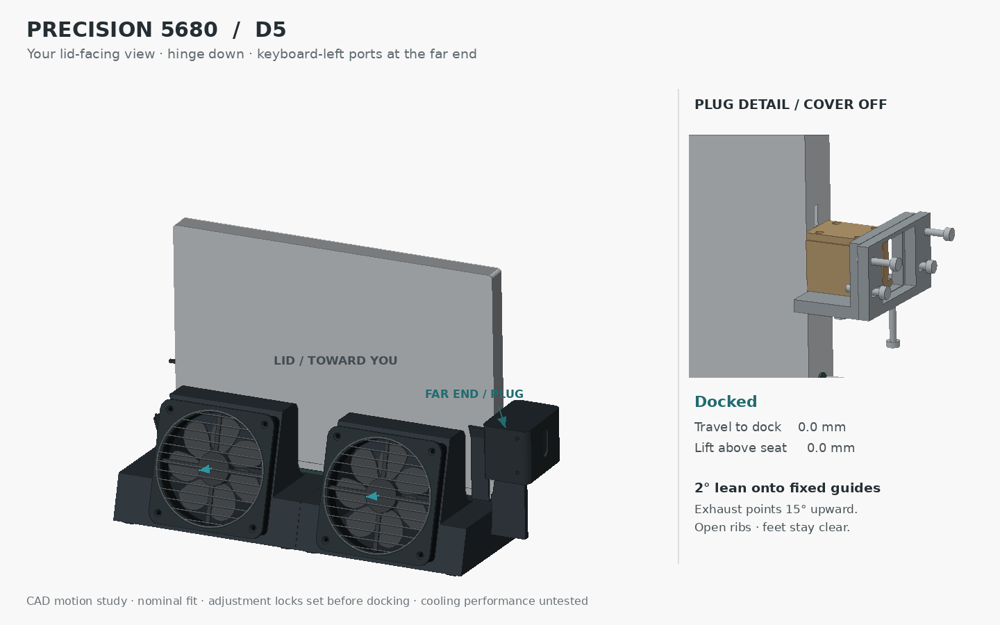
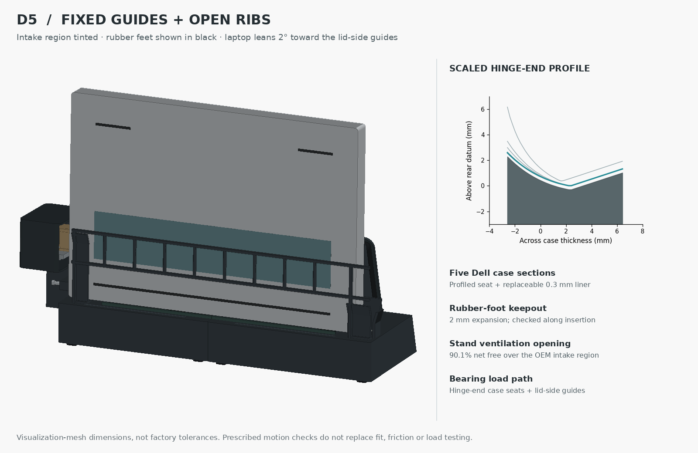

# Precision 5680 desk dock — D5

D5 uses **profiled fixed cheeks and an open rib frame**. The laptop leans 2° toward its lid-side guides, lowers into flared entries, then slides toward the far-end SD25TB5 plug. Rounded fan bezels, softened rear base corners and a removable adjustment cover clean up the enclosure.



[Docking animation](docking-cycle.gif) · [Full-resolution MP4](docking-cycle.mp4) · [STEP and source package](Precision_5680_D5_Review.zip) · [Contact and rib study](contact-study.png)

## Contact geometry and alignment

The user accepted sliding directly against fixed cheeks and required clearance from the rubber feet. D5 therefore uses fixed case-margin guides; the sliding-carriage concept was dropped before publication.

Five cross-sections through Dell's base-cover mesh establish the hinge-end seat profile. The printed seat follows the lower envelope of those curves, with a separate 0.3 mm liner for fit and wear adjustment. The reference CAD replaces its generic rounded heel at those contact margins with the extracted envelope. The closed lid remains a simplified envelope based on the published thickness; the source is a visualization mesh, not factory toleranced CAD.

The two end guides establish separated bearing locations. The far guide extends to the port region and widens by 5 mm per face over its final 12 mm to catch the descending case. A near-end flared stop marks the loading bay. Once seated, the laptop slides 18 mm along the fixed seats and guide faces. The USB-C plug does not carry the intended guide or bearing loads. The separate chassis stop controls final travel; the plug cassette retains independent height, transverse and insertion-depth adjustment.

The whole laptop/contact/plug arrangement leans 2° toward the lid side. Gravity is intended to settle it against the lid-side guides while the hinge-end seats carry its weight. The fans retain their independent 15° upward discharge. Initial physical setup must establish the liner fit and plug calibration. The user controls the lower-then-slide sequence; this revision has no automatic sequencing lock.

## Rubber feet and open ribs



Dell's mesh includes a long rear rubber strip roughly 17–20 mm from the rear-case datum, plus two front strips roughly 205–208 mm from it. The rear strip sweeps across much of the underside as the laptop lowers. Closely fitted ribs in that central sweep would catch it.

The bearing faces therefore land on the bare end margins. The central ribs brace those supports and sit behind the rubber-foot sweep. D5 includes all three foot envelopes and checks keepouts expanded **2 mm in every direction**, through lowering and sideways movement. These are reconstruction allowances, not statistical tolerances or measured hardware clearances.

The rib structure leaves **90.1% net free area** over the intake window extracted from Dell's grille mesh, exceeding the requested 80%. This percentage describes the added stand structure projected over the OEM intake region; it does not include the laptop grille's own solidity. The ribs stay above the hinge exhaust and do not cross the under-hinge extraction mouths.

## Aesthetic changes

- Rounded, countersunk fan bezels cover the frame edges while preserving the full fan aperture.
- A rounded removable shell conceals the plug stages and provides cable and tool-access openings.
- Flared guide lips and profiled seats replace the short square cheeks.
- A thin open back braces the end supports with limited blockage of the intake region.

The two fan cavities retain the D4 air-passage geometry and 15° upward exhaust. The [D4 sizing report](../D4/README.md) remains a conditional duct-sizing reference; the new laptop lean and sealing interface still require airflow and acoustic checks on hardware.

## Verification and limits

`validation.json` records 59 valid exported/reimported solids, nominal rigid-part clearance, far-edge port checks, 12 docking-path samples and expanded foot keepout checks. `alignment-validation.json` records the projected free area and 24 prescribed entry poses starting at −3, 0 and +3 mm cross-slot offset, centering before final seating. These selected paths clear the geometry and foot keepouts. They are not a gravity/friction simulation and do not demonstrate automatic correction from every placement or angular error.

The intended load path is case → profiled end seats / lid-side guides → fixed supports → desk. Strength, sliding friction, liner wear, tip stability, exact USB-C mating, cover retention, split-joint attachment and printed fits remain unqualified. **This is a CAD development revision, not a print release.** Use a contact/connector coupon before a complete print, and use OrcaSlicer for print preparation.

## Source and reproduction

`contact-profiles.json` records source SHA-256, five section curves, foot bounds and intake-window bounds. The [Dell-linked laptop visualization asset](https://content.hmxmedia.com/precision-16-5680-laptop-AR/gltf/precision-16-5680-laptop-AR.glb) supplies those measurements; the [Dell base-cover illustration](https://dl.dell.com/content/guides/public/Html/precision-5680-owners-manual/images/GUID-69967AFA-A9EC-45D7-9EA1-D2536DE17041-low.jpg) confirms the strip/vent arrangement. [D1's evidence](../D1/reference-evidence.png) retains port and cable dimensions. The user's photograph establishes handedness and stays outside the repository.

With Python, CadQuery 2.8, NumPy, Pillow, matplotlib, trimesh and ffmpeg:

```sh
# Optional: regenerate the included contact data from a decompressed source mesh.
python extract_contacts.py /path/to/laptop.glb
python build.py
python validate.py
python alignment_check.py
python contact_study.py
python animate.py
```

The archive contains STEP, editable code, parameters, extracted contact data, validation, the report and still images. The 9.5-second animation is linked separately. D5 is current; previous revisions remain as history.

## Interactive assembly

[Open the D5 exploded viewer](https://thereprocase.github.io/dell-5560-wall-mount/desk-dock.html). Orbit, select parts, remove the adjustment cover, or play the lowering and 18 mm docking slide. Viewer meshes are exported directly from this CAD build with `export_viewer.py`. Exploded offsets are illustrative.
