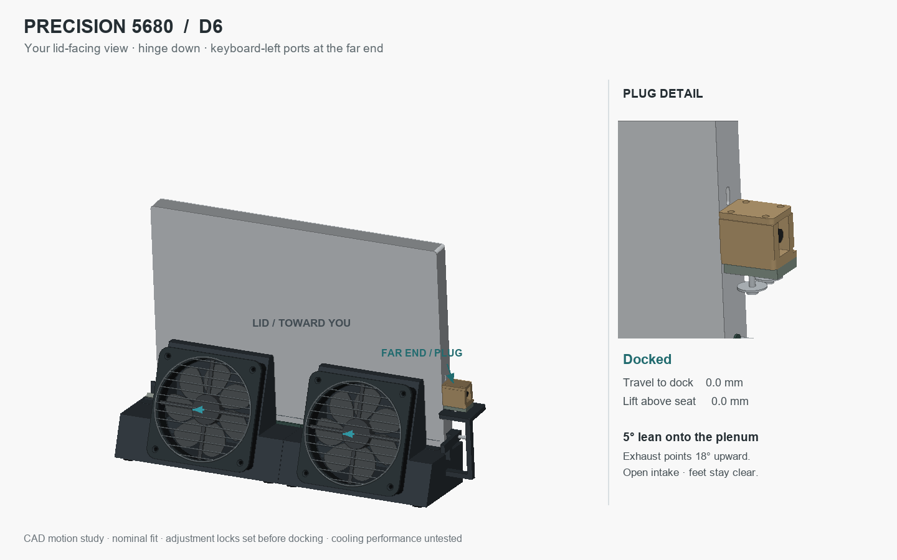

# D6 — the plenum is the stand

D6 makes the plenum wall the laptop backrest. The laptop's hinge-end case seats carry its weight; its lid leans 5° onto two thin replaceable liners attached directly to the plenum. The tall guide cheeks and underside rib frame are removed. The body remains split into two fan/plenum halves, with a profiled end seat integrated into each half.



[Interactive viewer](../../docs/desk-dock.html) · [CAD and source package](Precision_5680_D6_Review.zip) · [Port study](PORT_STUDY.md) · [Docking animation](docking-cycle.gif)

## Fewer mechanisms

The stacked height and lateral carriers, screw jack and separate adjustment hood are replaced by one exposed two-piece plug cassette on an integrated shelf. A 5 mm nominal shim stack sets height; a 1–10 mm stack provides −4/+5 mm height calibration. Two broad shelf slots allow nominal ±3 mm lateral and ±5 mm insertion adjustment. Two M3 locks with broad washers clamp the set position. Hardware is schematic and the required screw engagement must be detailed before printing.

The original Dell plug remains captured between the cassette and removable cap, with an axial clip. The separate chassis stop remains because it limits travel independently of the connector. Low lips at the bare case end margins assist placement without surrounding the laptop with upright rails. The raised near-end loading fence is removed so the loading end is open. Users lower onto the seats, then slide 18 mm to dock; passive correction from arbitrary angles is not claimed.

The two 120 × 15 mm fans discharge 18° above the desk. Their centers move 37 mm closer to the laptop than the first local D6, with a 58 mm fan-center datum. The [compact-depth study](AIRFLOW_STUDY.md) records the candidate sweep and CAD clearances. The revised duct rear wall also carries the lid contact. The underside has no rib frame over the intake window, and the rubber-foot keepout envelopes remain clear on the sampled docking path. D4's numerical duct-sizing claims are historical: this revised cavity has not been flow-tested or acoustically qualified.

## Ports corrected

The model preserves the Dell mesh's handedness. Both Thunderbolt ports are on the keyboard-left end, which appears on the right in the lid-facing view. The opposite USB-C / DisplayPort port is now represented separately. See [the focused study](PORT_STUDY.md) for the double-reflection cause, source hashes, measured coordinates and checks.

## Checks and remaining work

- `validation.json`: STEP round-trip validity, rigid-part intersections, 12 docking poses, expanded rubber-foot keepouts, three independent port probes and camera orientation.
- `alignment-validation.json`: direct lid-to-liner and liner-to-plenum contact, and an unobstructed intake screening slab.
- `geometry.json` and `flow-geometry.json`: component bounds and cavity volumes from this build.

The reference laptop is a simplified closed envelope with source-derived heel contacts and USB-C openings. Physical lid pressure, sliding friction, liner attachment, wall strength, tip stability, exact connector engagement, fan and split-body fastenings, print orientation, seal compression, airflow and noise still need qualification. The two shelf adjustments are nominal design ranges; only the nominal cassette position is included in the assembly collision screen. This remains a CAD development study, not a production print release. Use OrcaSlicer for subsequent print preparation.

## Local reproduction

Python 3.13 and the already-installed CadQuery 2.7.0, NumPy, trimesh, Pillow and matplotlib were used. No npm installation is needed. From the repository root:

```text
python desk-dock/D6/validate.py
python desk-dock/D6/alignment_check.py
python desk-dock/D6/export_viewer.py
python desk-dock/D6/airflow.py
python desk-dock/D6/contact_study.py
python desk-dock/D6/animate.py
```

The build reads the included source-derived JSON; it does not require downloading the Dell mesh. The fresh original asset and conversation/photo are retained separately under `D:\Code\Modeling\local-transfer`. Open the local viewer using `Open-Desk-Dock.ps1` at the repository root. D1–D5 remain intact as design history; the D5 viewer is archived as `docs/desk-dock-d5.html` and has a known mirrored port layout.
