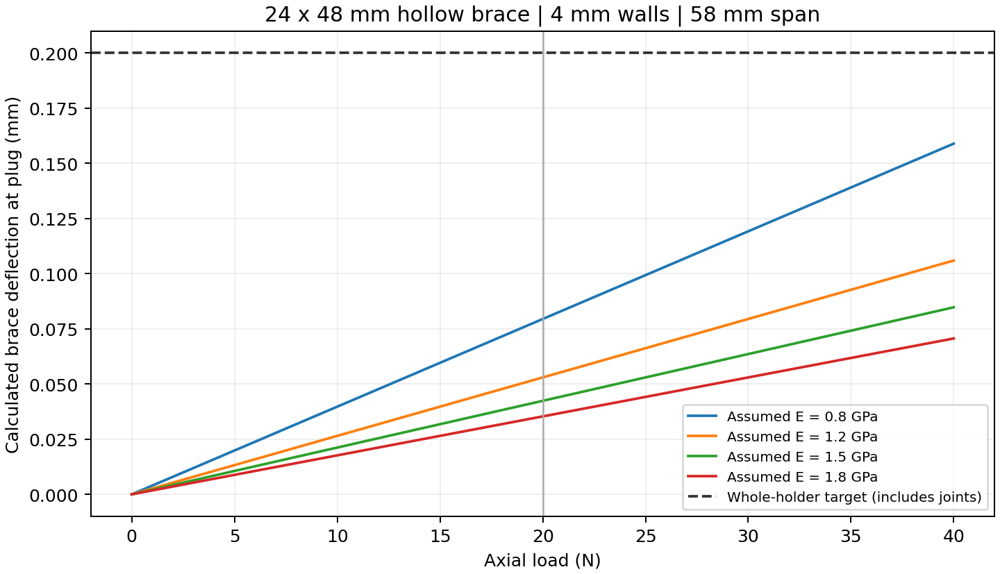
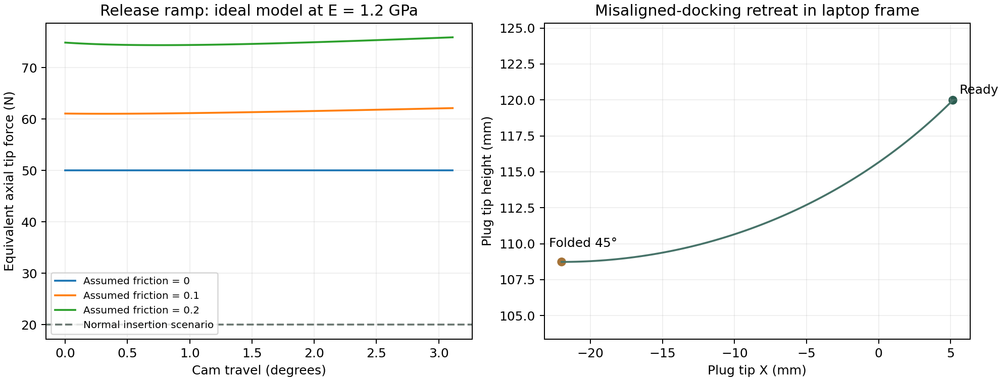

# Printable plug holder: alignment and resettable breakaway

This revision targets **no more than 0.20 mm axial movement at 20 N**, followed
by a **50 N-class resettable release during misaligned docking**. These are
prototype acceptance targets, not measured performance. The fixed chassis stop
remains independent of the moving cassette. The release is not intended to
limit force on an already mated connector.

## Where the loads come from

The current [USB-IF Type-C Release 2.5 archive](https://www.usb.org/sites/default/files/USB%20Type-C%202.5%20Release%20202603.zip)
contains the March 2026 specification. PDF page 136, §§3.8.1.1–3, specifies
5–20 N insertion, 8–20 N initial/32nd-cycle extraction and 6–20 N after
10,000 cycles, tested at no more than 12.5 mm/min. Those clauses explicitly
exempt mechanical docking. They inform the 20 N sizing scenario; they do not
establish a Dell docking force or a safe impact load. The separate 40 N cable
pull-out requirement concerns cable strain relief.

Actual five-specimen measurements in the
[Molex 218847 test report](https://www.molex.com/content/dam/molex/molex-dot-com/products/automated/en-us/productspecificationpdf/218/218847/2188470001TS-000.pdf?inline=)
give the following results. This is a particular connector family, not the
user's cable or Dell port.

| Measurement | Minimum | Mean | Maximum |
|---|---:|---:|---:|
| Insertion | 11.39 N | 11.95 N | 12.64 N |
| Early extraction | 14.93 N | 15.69 N | 16.32 N |
| Extraction after durability | 11.05 N | 11.46 N | 12.42 N |

The complete source audit, including another measured Molex family and printed
PETG material data, is in [material-load-sources.md](material-load-sources.md).
No public Dell-specific force curve was found. **50 N is the user's chosen
misalignment-release target**, not a USB standard value.

## Structure and alignment

The old long, thin C-shaped arm is replaced by an explicit hollow brace:
**24 mm wide × 48 mm deep, 4 mm walls, 58 mm nominal span**. It joins the nearby
plenum tower and deck. The moving carrier sits beside that brace so it can
fold without striking it. A broad rear return and underside cheek stiffen the carrier against the plug's sideways eccentricity; the cassette remains accessible from above. The rigid locating surfaces are separate from the
replaceable spring that supplies latch preload.

An eccentric-load beam calculation uses the actual nominal plug offset and
the specified adjustment corners. With an intentionally low assumed modulus
of 0.8 GPa, the brace contribution is **0.067 mm nominal / 0.07945 mm worst**
at 20 N. At 1.2 GPa it is 0.045 / 0.053 mm. Considering the brace alone leaves
approximately 0.12055 mm of the 0.20 mm target for every other component and
interface. Their combined stiffness would have to exceed 166 N/mm. That is
an allocation, not a prediction that those parts meet it.

The rear cable opening interrupts the carrier's reinforcing return. An
independent, segmented torsion screen now gives **0.049-0.055 mm nominal**
and **0.082-0.090 mm at dz=-4, dy=-3**, at the same 20 N / 0.8 GPa assumptions.
These are local carrier contributions, separate from the brace result. The
earlier 0.031-0.036 mm estimate described the carrier before the cable notch
and must not be used for this revision. Removing a small material volume
does not establish a small stiffness change.

The local screen uses either the plain trough height or the entire
flare-affected height as a weak band. It does not resolve load sharing,
constrained warping, the upper transition, cam/pilot contact, clamp seating,
or tower/root compliance. Its range is not a rigorous bound, and the brace
and carrier numbers must not be added as proof that total movement is below
0.20 mm. **Complete-holder alignment remains unqualified.** The derivation
and reproducible sensitivity calculation are in
[independent_cable_route.md](independent_cable_route.md),
`independent_cable_calculation.py` and `independent_cable_results.json`.

The calculation includes eccentric bending, member shear and approximate
torsion. It assumes a fully fixed root, a rigid transfer to the plug, isotropic
linear material and dense walls. It is **not complete-assembly FEA**. The
source and section sweep are in `arm_stiffness.py` / `arm-stiffness.json`.
The 0.8 GPa case is a sensitivity assumption, not a claimed modulus at a
specific temperature. Printed PETG stiffness depends on formulation, layer
orientation, temperature and processing.

## Resettable mechanism

The printed 10 mm hinge axle lies 27.15 mm behind and 27.15 mm above the nominal
plug tip, about the laptop-frame Y axis. A positive fold moves the cassette
outward and downward. At 45° the tip has retreated 27.15 mm outward and
11.25 mm downward. An integral 8 mm peg and relieved arc provide a physical
fold stop. The cable needs a loose service loop through this complete travel.
Although the tip drops, the rear cable outlet rises about 25.63 mm at the
45 degree fold. Its outward tangent also rises, so the near cable must be
free to move upward and outward. The open-top trough permits cable lay-in
after removing the cap and its pin. Its R4.25 bottom and flared mouth are
based on a provisional 6.5 mm cable continuation; the actual cable fit and
bend behavior require measurement. The illustrative 30 mm straight, R30
turn and 30 mm tail are clearance-screening geometry, not a specified cable
bend radius or a flexible-cable simulation.

Three broad face-cam teeth register the ready angle. A shallow, concentric
45° conical pilot supplies radial location; the clearance-fit axle guides the
motion. The female cam has 0.15 mm radial relief. Mating seat surfaces have
zero nominal axial CAD gap and require a matched print-fit check. That exact
CAD contact does not imply zero clearance or zero movement after printing.

A replaceable printed spring cartridge has two fixed-guided leaves, each
30 × 24 × 3 mm, with a reinforced central island and outer frame. A large
printed hand nut sets preload. An axle collar limits advance to the nominal 1.2 mm preload; back the nut off to reduce force. The collar moves with the axle during release, preserving the additional 0.8 mm spring travel. Do not force the nut past its shoulder. If a soft or relaxed spring cannot reach the intended force within that limit, replace/revise the spring rather than overtighten it. At the nominal modelling modulus of 1.2 GPa:

- Combined stiffness: `k = 2 E b t³ / L³ = 57.6 N/mm`.
- Initial deflection 1.2 mm: preload 69.1 N.
- Additional cam lift 0.8 mm: maximum spring force 115.2 N.
- Ideal beam surface strain: 1.2% initially, 2.0% at the crest.

The stored spring energy over the release stroke is 0.0737 J. The cam ramp
uses `lift(θ) = sqrt(preload² + 2 T θ / k) − preload`, with
`T = 50 × 27.15 = 1357.5 N·mm`, to avoid the rising release force of a simple
constant-angle ramp. Its nominal angular ramp is 3.112°. Once clear of the
seat, the carrier folds to its stop and is returned by hand to click into the
ready position. The spring is displayed deflected in the assembly and must
be printed in its unloaded shape.

## Why the nut must be calibrated

The ideal cam calculation omits friction. For a sliding ramp, the simple
free-body extension is `S = P (tan α + μ) / (1 − μ tan α)`; the frictionless
relation is consistent with [Carr Lane's detent guidance](https://www.carrlane.com/engineering-resources/technical-information/manual-workholding/ball-plunger-technical-information).
At the nominal modulus, assumed friction coefficients of 0, 0.1 and 0.2 give
maximum equivalent forces of approximately **50, 62 and 76 N**. These are
sensitivities, not measured PETG friction coefficients. Pilot, axle and nut
friction, finite cam geometry, frame flexibility and creep add uncertainty.

The 50 N target applies separately to nominal axial -X or downward -Z force
at the tip. A combined 45° -X/-Z force produces the same torque at about
35 N resultant. Lateral Y load does not trigger this hinge. Adjustment of
the plug changes the lever arms. This is not an omnidirectional 50 N clutch.
A static release setting is also **not an impact-force ceiling**: approach
speed, initial contact stiffness, release stroke and remaining travel matter.

## Printing and bench acceptance

Use the selected P1S, 0.4 mm nozzle and PETG. The structural arm, carrier,
cam seats, axle, spring cartridge and clamp need dense printed material;
100% infill is the simple initial setting for those parts. The deliberately
hollow CAD duct stays hollow. Sparse infill is not credited in the calculation.
Orient the spring so its leaf length and bending stress run in the bed plane;
export uses the unloaded shape. Thread coupons must qualify the matched
custom threads before the large bodies are printed.

1. Assemble and seat the detached mechanism with a dummy plug, without the
   laptop. Apply load at the intended contact point with a measured force.
2. At 20 N axial load, measure movement relative to the adjacent laptop bearing
   datum. Require ≤0.20 mm and no cam climb or permanent set.
3. Increase axial and downward loads separately. Adjust the preload nut to
   obtain the desired 50 N-class release and record both onset and peak force.
   A 1/12 turn of the 2 mm-pitch nut changes axial setting by about 0.167 mm.
4. Reset repeatedly and check that the tip returns to the same position.
   Repeat the 20 N hold and release tests after a warm dwell representative
   of use. Inspect the spring roots and cam faces for set, whitening or wear.
5. Confirm full retreat with the actual cable loop and fan wiring installed.
   Fan tie lugs must not restrain the moving USB cable. Calibrate the chassis
   stop and actual cable fit only after the detached checks pass.

No slicer toolpaths or physical load/impact qualification have been completed.
