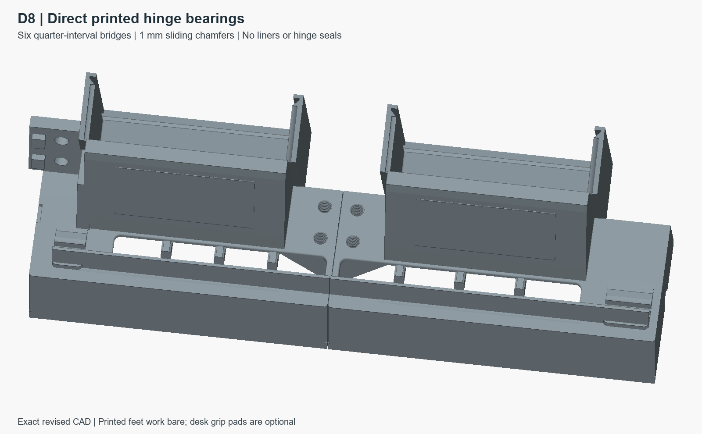

# D8 hinge bearings — direct printed revision

Six 6 mm-wide bridges support the straight hinge edge at 25%, 50% and 75%
of each opening. Both sliding ends have 1 mm chamfers. The printed surfaces
reach laptop-local Z=58 mm directly: **no liners or hinge seals**.

The centers from the keyboard-left datum are 74.710, 107.420, 140.130,
218.275, 255.410 and 292.545 mm. They follow the 5-degree laptop lean.
The bridges occupy 36 mm of 279.38 mm combined opening length, leaving 87.1%
between them. This is a length measure, not a flow-rate prediction.

See [DIRECT_CONTACTS.md](DIRECT_CONTACTS.md) for the liner/seal removal,
optional desk pads and current checks. Contact height follows the existing
laptop reference envelope and still requires physical fitting.

