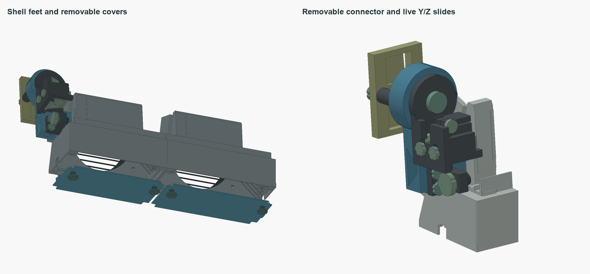

# D8 — removable adjustment module and print-oriented shell

D8 develops D7 into a lighter, serviceable prototype. It preserves the source-handed port location, 5° laptop lean, 18° fan discharge and printed face-cam breakaway. **This is a CAD and manufacturing review, not a physically qualified print release.**

Download the complete [STEP archive](Precision_5680_D8_STEP.zip), the [print and source package](../../docs/downloads/Precision_5680_D8_Review.zip), or the individual [manufacturing STLs](print/). The ZIP contains the full, unchanged `Precision_5680_D8.step`; extract it before opening in CAD. The [archive record](step-archive.json) verifies its extracted hash against the generated file. Compression keeps the 30 MB STEP below the upload interface's request limit.

## What changes

- **A removable connector module.** Only its keyed mounting shoe belongs to the left shell. Two accessible 8 mm printed hand screws release the complete module, including the cable holder and separate laptop-stop bracket. The keys and broad seat transmit thrust; the screws clamp the joint.
- **Real live adjustment.** The same Z saddle slides −4 to +5 mm; the same cable cradle slides ±3 mm in Y. Two Z locks and one Y lock secure them. The separate threaded laptop stop adjusts ±4 mm in X. No temporary fitting jig, replacement height shim or newly printed calibration plate sets the cable position. The historical `X_depth_overmold_clamp` name is retained, but this part now slides in Y and is positively restrained in X.
- **Gravity through the shell perimeter.** Four integral corner feet on each shell connect to its walls. Separate 3 mm desk pads meet the desk. The bottom covers clear these feet and carry service handling, not laptop weight.
- **Thin removable covers.** A 2 mm skin, perimeter overlap and three shallow ribs replace the heavy cover construction. Compact ring bosses and wall webs replace four large solid fastening blocks per shell.
- **Flat grilles and separate clips.** The grille's tall return becomes two small replaceable clips. Their flexible leaves print in the layer plane. A 121.5 mm pocket and 27.8 mm axial envelope accept the researched fan sizes with deliberate printing clearance. No full fan gasket is specified. See [fan fit](FAN_FIT.md).
- **Explicit print poses.** Every production STL has a chosen bed face and load-orientation note. The shells print upright on a continuous lower perimeter. Sparse 1.6 mm gusset ribs give the low duct roofs bridge landings at 10 mm pitch, while leaving the full mouth column clear. Fan rails have 45° lower ramps; the connector brace has internal haunches reducing its roof bridge to 8 mm. The old spring stand-offs are separate end-printed spacers. Springs and clips export in their unloaded shape.



## Assembly and adjustment

Seat and join the two shells with the existing bridge keys and hand locks. Apply the desk pads. Fit fans, slide the flat grilles into their rails and install the top clips. Lay fan leads in the existing edge routes and close the bottom panels. Keep wiring out of the fan swept volumes.

With the laptop unloaded, engage the connector module's keys in the shell shoe and install its two hand screws. Fit the independent stop bracket, existing face-cam hardware, cable cradle, cable and cap. Keep a loose cable loop behind the module.

Use the Dell-model port location as the nominal setting. Loosen the two outboard Z knobs to move the saddle vertically; loosen the knob beneath the cradle to move it across the laptop thickness. Adjust the independent stop to set the laptop's final X position. Align gently and lock the adjustments; do not force a misaligned connector. The adjustments follow the laptop's leaned frame. They reposition rigid parts without regenerating them.

To remove the module, unload the laptop, remove its two mounting locks, pull the module at least 4.3 mm toward −Y to clear the keys, then withdraw toward −X. This sequence is the design intent; consult the latest sampled motion report for the paths actually checked. The cable stays captured. Recheck alignment after removing the keyed module; printed clearance and clamp seating do not establish repeatable precision positioning by themselves. To replace only the cable, withdraw the 6.5 mm cap pin toward −Y and lift the cap.

Hand controls use the existing custom 2 mm-pitch printed thread family. They are not ISO metric threads. Access is grouped by service task: bottom covers from below, fan clips from above, Z adjustment from the outboard end and module mounting from the exposed side. There is no hidden nut trap or required fan gasket.

## Print and evidence

Use [PRINT_DESIGN.md](PRINT_DESIGN.md) and the per-part [print manifest](print-manifest.json). The baseline is PETG, a 0.4 mm nozzle, 0.20 mm layers, five walls and six top/bottom layers. Keep the loaded mechanism dense for initial qualification. Molded cavities, open ducts and thin covers are represented in CAD; dense infill does not fill those spaces.

OrcaSlicer remains the project's default. The inherited Orca run crashed and its status record says not to resume discovery. An available offline CuraEngine may screen deposited paths here; its results must be labeled as a generic review profile. **Do not send its review G-code to a P1S.** Actual printer preparation requires the correct P1S/material profile and machine start/end sequences.

The supplied source uses CadQuery 2.7.0 / OCCT 7.8.1.1. To regenerate once:

```sh
python desk-dock/D8/regenerate.py --cache /absolute/scratch/d8-cache
python desk-dock/D8/print_check.py
python desk-dock/D8/validate.py --cache /absolute/scratch/d8-cache
python desk-dock/D8/render_review.py /absolute/scratch/d8-cache
```

`build.py` creates STEP and geometry manifests; `export_print.py` supplies manufacturing poses. References, compliant desk pads and liners are not counted as PETG production meshes. The stop bumper is a separate flexible-material part. Review-cache BREPs and generic slice paths are intermediates.

Regeneration writes the uncompressed STEP locally. When republishing regenerated geometry, refresh its ZIP and archive hashes along with the manifests; the tracked archive must not retain an earlier build. After updating the review files, run `python desk-dock/D8/package.py` to refresh both Pages downloads and `download-manifest.json`. The print/source ZIP and complete STEP ZIP are separate downloads.

See [CURRENT_STATUS.md](CURRENT_STATUS.md) for the final measured mass, current checks and remaining gates. The [public viewer](https://thereprocase.github.io/5680-dock/desk-dock.html) now uses D8 geometry. The archived D7 viewer and archive retain D7.

The completed review passes 83-solid assembly checks, all 43 mesh preflights and the 42-part PETG deposited-path envelope screen. CAD volume corresponds to 1.243 kg PETG; normal automatic supports and individual brims bring the generic estimate to **1.659 kg**. Plan on **1.8–2.0 kg** for a first build. This estimate uses a generic offline profile, so final P1S support choices and physical strength still need qualification.

The female thread cutter includes a documented 0.045 mm additional minor-radius relief to avoid a CAD-kernel degeneracy. Major and crest clearances stay unchanged. The partial-thread screws use a tapered runout that exports as a closed mesh. See the hashed checks in [review-evidence](review-evidence/). Reprint thread fit samples for D8; D7 coupon fit does not validate this updated female root.

## Remaining engineering work

The existing printed face-cam and spring are retained. The cartridge is rotated 90° about its unchanged preload axis to clear the neighboring fan rail during module removal; its leaf dimensions are unchanged, and both mounting screws and spacers follow the rotation. The long preload screws now use smooth 8 mm shanks with only the final 12 mm threaded; the support contains only the corresponding 12 mm threaded land. The preload nut's 2 mm compression nose has a smooth clearance bore, leaving thread engagement in the 8 mm nut body. A steel-preloaded face-detent redesign is a separate decision; D8 does not claim it has been implemented. Current printed spring creep, release force, axle motion during release and mated-port protection remain unresolved. The ≤0.20 mm complete-holder deflection at 20 N and nominal 50 N release remain test targets, not demonstrated capability.

Physical fitting must establish custom-thread fit, cap-pin retention, overmold extraction grip, slider locking, keyed-module repeatability and clip preload. Whole-assembly stiffness, warm creep, tip stability, cooling and noise need measurement. The source laptop is a visualization-derived envelope, so adjustment travel is useful but is not proof of real port alignment or safe mating force.
