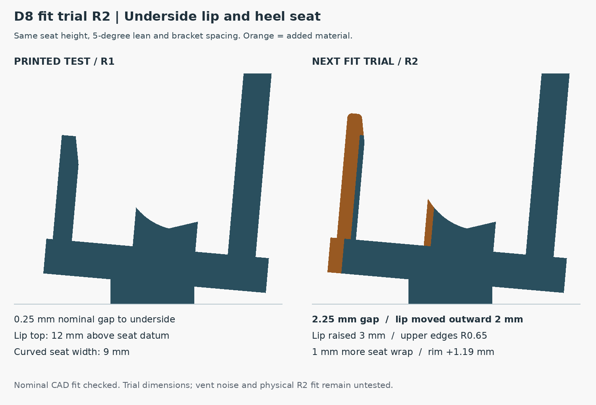

# D8 R2 quick-fit brackets

**Local fit trial, 17 September 2026. Print the bracket twice.**

The first physical pair showed that the short upright lip on the laptop's
underside needs more vent clearance and more height. The heel seat also needs
a little more wrap for positive engagement at rest. The user identified the
short upright lip, not the tall lid support. Whistling was a concern, not a
reported acoustic measurement.

## Trial changes

| Feature | Printed R1 | R2 trial |
|---|---:|---:|
| Closest lip clearance to nominal underside plane | 0.25 mm | 2.25 mm |
| Lip top above the seat datum, in the leaned frame | 12 mm | 15 mm |
| Lip upper-edge radius | Sharp | 0.65 mm |
| Curved heel-seat width | 9 mm | 10 mm |
| Underside seat-rim height | Baseline | +1.193 mm |

The lip moves outward 2 mm and rises 3 mm. Its supporting deck extends with
it. The curved seat extends 1 mm toward the underside, following additional
points extracted from the original Dell-linked visualization mesh. Its
lowest contact point, seat height and the tall lid support remain at their
existing datums; the nominal lean remains 5 degrees. These are selected trial
increments, not dimensions measured from the user's laptop.



## Files and setup

- `D8-R2-quick-fit-bracket-print-TWO.stl`: **one** bracket, already on its broad
  side for printing. Print **two identical copies**, normally one per plate.
- `D8-R2-quick-fit-bracket.step`: one editable solid in its in-use orientation.
- `fit-parameters.json`: the four explicit trial changes.
- `seat-profile.json`: original and extended heel-contact sections.
- `checks.json`: geometry checks, motion samples, input and export hashes.

Arrange and slice in OrcaSlicer with the actual P1S/nozzle/material profile.
The inherited starting settings are PETG, 0.4 mm nozzle, 0.20 mm layers, four
walls, five top/bottom layers and 20% gyroid. Review adhesion and the preview
before printing. Each mesh is 150.914 x 135.022 x 38.1 mm in print orientation.
Its extruded structural profile is intended for support-free side printing.
No usable Orca slice, machine G-code, material-use estimate or print time is
included; the 251.63 g pair figure in the check report is fully solid CAD
volume converted at 1.27 g/cm3, not a slicer estimate.

Stand the two brackets on their long feet, facing the same direction, with
**318.48 mm clear between their inner flat faces**. The center spacing is
356.58 mm. Place the laptop's keyboard-left end 16 mm inward from the
leftmost outer bracket edge; its opposite end is 25 mm inward from the
rightmost outer edge. These are the same asymmetric end positions as R1.
The engraved R2 label distinguishes this pair from the first print.

Support the laptop during initial seating. Check that it settles into the
heel curve, releases by lifting without binding, and has a visibly open gap
along the short lip. Compare sound at the same laptop workload and fan
setting as the old pair. A larger nominal gap alone does not establish that
whistling or vent restriction is eliminated. The two unjoined brackets can
shift on the desk, so recheck spacing after moving them.

## What was verified

The STEP reimports as one valid solid. The STL is one connected, watertight,
consistently wound mesh with positive volume and room for an 8 mm brim in
the rectangular 256 mm P1S envelope. The reconstructed original structure
matches the published R1 STEP exactly outside the label engraving.

Both brackets have zero nominal laptop/foot collisions and clear the
2 mm-expanded rubber-foot envelopes. A 0.02 mm contact probe establishes
nominal seat contact. Ten sampled lowering/lifting heights from 0 to 40 mm
pass for each bracket along the leaned laptop axis; these finite samples
are not a continuous-motion proof.

The published simplified laptop reference stops its curved heel cut at the
old 9 mm seat. For this trial that cut is extended using the same original
mesh (SHA-256 recorded in the report). The added seat region was also
compared independently with 5,002 samples across the two bracket footprints.
Maximum sampled penetration into the visualization mesh is 0.00771 mm,
within the declared 0.015 mm profile interpolation tolerance. This is a
mesh-derived fitting approximation, not a manufacturing tolerance or proof
of exact surface contact on a real laptop. Physical R2 fit, wear, strength,
stability and acoustic behavior remain untested.

## Reproduce and continue

Generated with CadQuery 2.8.0, trimesh 5.1.0, NumPy and Pillow. The production
D8 generator declares CadQuery 2.7.0; R2's actual runtime is recorded in
`checks.json`. From a checkout containing the reference mesh:

```sh
python desk-dock/D8/quick-fit/R2/build_quick_fit.py
python desk-dock/D8/quick-fit/R2/render_comparison.py
```

The standalone download includes these inputs under `source/`; change into
that directory before running the same commands.

The original R1 files and production D8 geometry remain available. Apply the
chosen lip and heel changes to the complete dock after confirming this fit
trial, then regenerate its shell geometry, laptop reference, contact/motion
checks, print meshes, viewer and download packages together. The production
lip spans the laptop width and needs its own rubber-foot/vent review; the
two temporary end brackets do not qualify that continuous lip.
