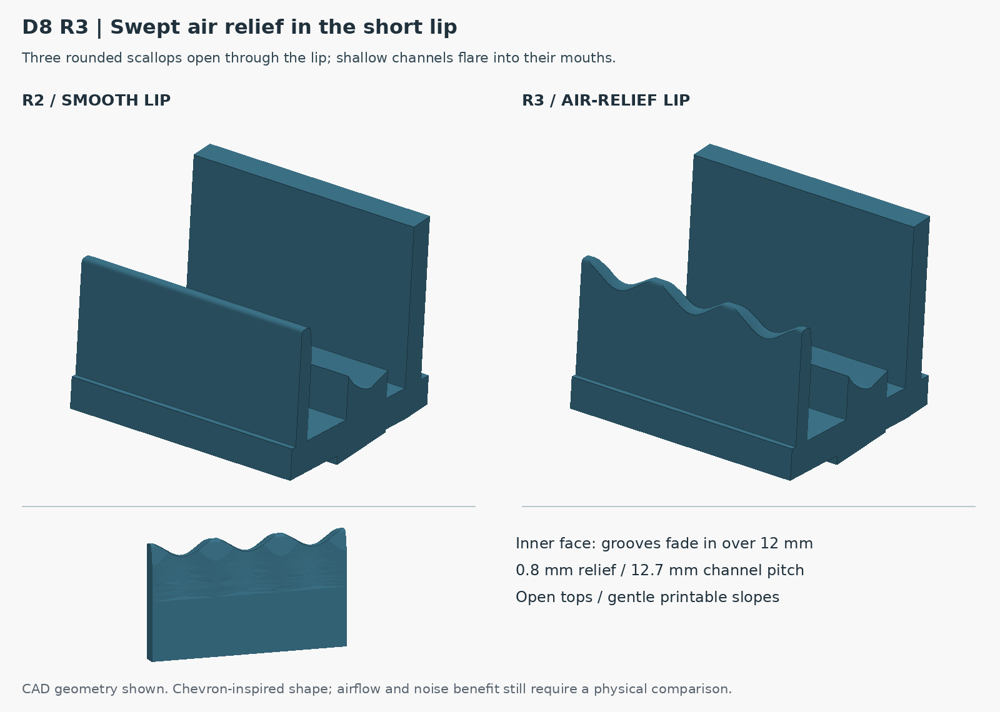
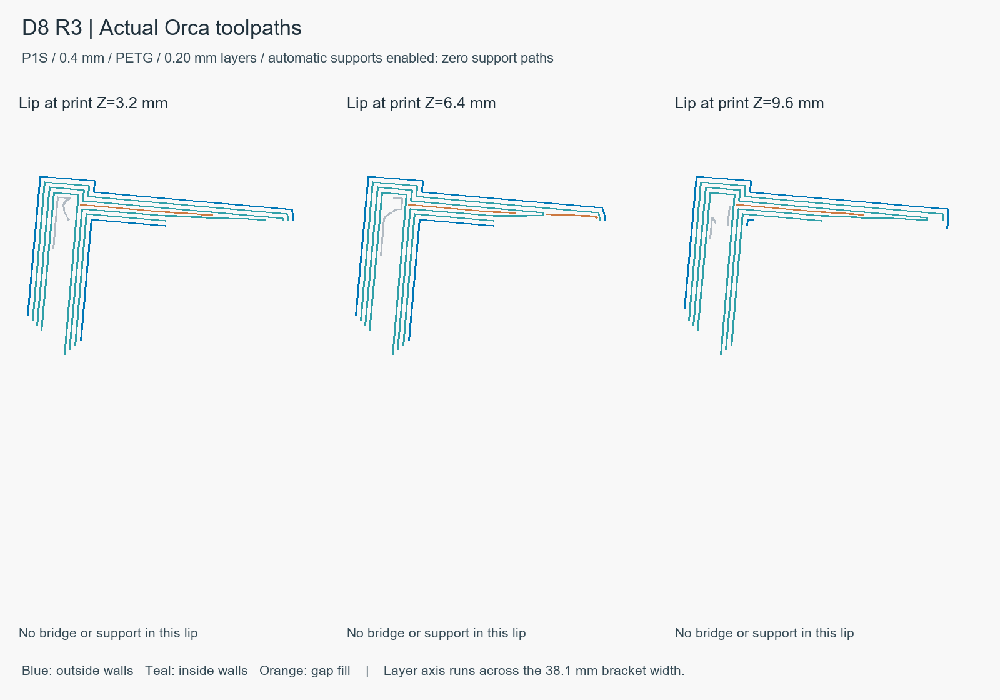

# D8 R3: gently swept lip relief

**Fit and airflow trial, 17 September 2026. Print two identical brackets.**

R3 adds three broad, rounded scallops and shallow flared channels to R2's
short underside lip. The crest spacing is 12.7 mm across each 38.1 mm bracket.
Each opening is about 2.55 mm deep at its central throat and 2.95 mm deep at
the mouths. Inner-face relief grows smoothly to 0.8 mm over 12 mm of height,
then opens into the scallop. The nominal full-depth wall remains 1.95 mm.
The channels are open at the top and have no enclosed roofs.

R2's 2 mm outward lip shift, 3 mm lip rise at the crests and 1 mm extra
heel-seat wrap are retained. The nominal 2.25 mm clearance increases within
the relieved areas. The seat height, lid support and 5-degree lean remain
at their existing datums.



The user's 787 analogy informed the smooth, interrupted edge. Aircraft
chevrons affect mixing between engine exhaust streams; see
[NASA's explanation](https://www.nasa.gov/aeronautics/nasa-helps-create-a-more-silent-night/).
This laptop lip operates in different conditions. No airflow increase or
noise reduction is established by the shape or the geometric checks. Compare
R2 and R3 under the same workload/fan conditions before carrying the feature
into the complete dock.

## Print and inspect

- Open `OPEN-ME.3mf` from the standalone kit in OrcaSlicer. The named plate
  contains **one bracket**: print the plate twice. Its existing side-print
  orientation is frozen in the package.
- `D8-R3-quick-fit-bracket-print-TWO.stl` is the fallback mesh in the same
  broad-side orientation. `D8-R3-quick-fit-bracket.step` is the in-use CAD pose.
- `D8-R3-one-bracket-P1S-0.4-PETG.gcode` preserves the reviewed slice for the
  listed machine/material setup. No printer has been contacted or started.
- The frozen profiles are Repro P1S 0.4 nozzle and Repro Generic PETG 0.4
  Starter, with 0.20 mm layers, four walls, five top/bottom layers, 20% gyroid
  and a 5 mm outer brim. They use 255 C nozzle and 70 C textured-PEI bed.
- Orca reports a generic filament warning because both its bed temperature
  and PETG vitrification field are 70 C. The existing preset is preserved;
  select the actual spool/plate settings before printing. Physical extrusion
  calibration, adhesion and lip quality are not verified by this slice.
- Estimated use is **85.76 g and 2h 49m 56s per bracket**, or about 172 g and
  5h 40m for two sequential prints. These are slicer estimates.

Stand the brackets with **318.48 mm clear between their inner faces**;
center spacing is 356.58 mm. The laptop's keyboard-left edge is 16 mm inward
from the left outer bracket edge, and the opposite edge is 25 mm inward
from the right outer edge. Support it during first seating and confirm
unobstructed lift-out, vent clearance and stability. The brackets are unjoined.

## Printability evidence

The swept surfaces have a conservative analytical slope limit of 36.58
degrees from the print vertical. An independent section check of the final
lip at 0.20 mm spacing found a maximum 0.14441 mm advance per layer
(35.83 degrees) across 189 layer pairs. No material extends beyond the
45-degree support envelope. These are self-supporting slopes, not literally
zero geometric overhang.

OrcaSlicer 2.4.2 completed the slice with automatic normal supports enabled
at 45 degrees and generated **zero support extrusion paths**. The lip has
**zero bridge paths**. Two internal-bridge feature blocks at print Z=37.2 mm
close infill beneath the top skin elsewhere in the bracket. The full emitted
model/brim envelope is inside the P1S bed and clear of its front-left exclusion.
The exported 3MF required no mesh repair and contains the same G-code as the
standalone file. The `support_used` metadata flag reflects the enabled support
setting; the actual toolpaths and filament record contain no support use.



Headless Orca could not create an OpenGL thumbnail; separate CAD and toolpath
images are included. This did not prevent slicing or native 3MF export.

Both bracket positions also pass the R2 nominal laptop, expanded-foot and
sampled lowering checks. STEP reimport and the STL topology checks pass.
The seat's source-mesh interpolation and physical-fit limits described in R2
still apply. R3 noise, cooling, wear, strength and physical fit remain untested.

## Reproduce

The source bundle includes the original hashed laptop reference and required
D8 inputs. In the kit's `source/` directory, using CadQuery 2.8.0, trimesh
5.1.0, NumPy, Pillow and Shapely 2.1.2:

```sh
python desk-dock/D8/quick-fit/R3/build_quick_fit.py
python desk-dock/D8/quick-fit/R3/check_relief_layers.py
python desk-dock/D8/quick-fit/R3/render_relief.py
```

`checks.json`, `layer-support-check.json`, `orca-slice-check.json` and the
package manifest identify the exact files and scope of verification. R2 is
preserved for a direct comparison. The production dock and public site have
not been revised by this local fit trial.
