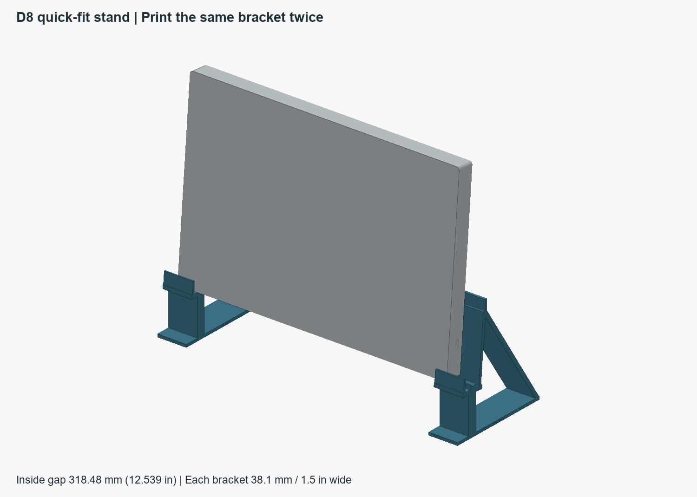
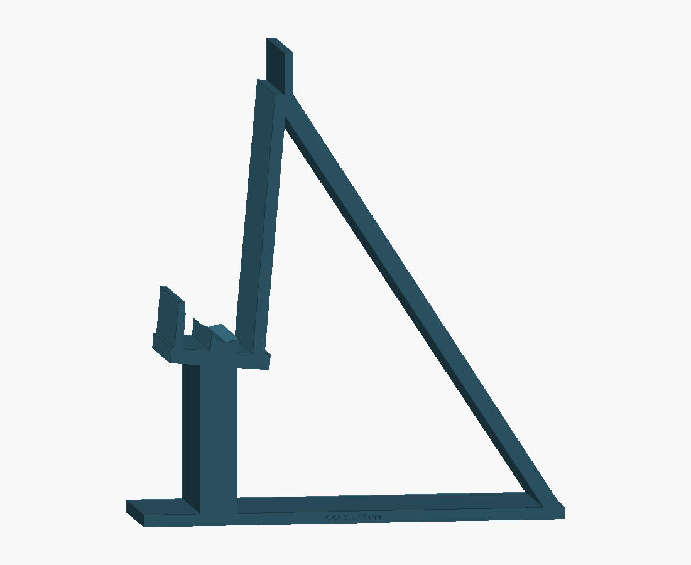

# D8 quick-fit stand: print this bracket twice

**17 September fit feedback:** the printed pair needs more clearance and
height at the short underside lip and slightly more heel-seat engagement.
The separate [R2 fit trial](R2/README.md) adds 2 mm of outward lip clearance,
3 mm of lip height and 1 mm of curved-seat wrap. The original R1 files below
remain the baseline; R2 physical fit and noise are not yet tested.

The [R3 air-relief trial](R3/README.md) retains those fit changes and adds
three gently swept, open-top channels to the short lip. Its final lip-layer
check and Orca slice pass without support or bridge paths in the channels.
Physical airflow/noise benefit remains unmeasured.

Two identical 38.1 mm (1.5 inch) wide brackets hold the closed laptop at D8's nominal seat height and 5-degree lean while marking the planned stand envelope. No fans, screws, liners or joining hardware. This is a temporary fit/desk-space mockup, separate from the 43-part production dock.

## Set it on the desk

1. Print **two copies** of `D8-quick-fit-bracket-print-TWO.stl`. It is already laid on its broad side profile for edge printing; do not stand it upright in the slicer.
2. Stand both brackets on their long flat feet, facing the same direction. The tall sloping rail supports the laptop lid; the short lip faces its underside.
3. Leave **318.48 mm (12.539 inches) clear between the inner flat faces**. The gap is engraved on the bracket. Center spacing is 356.58 mm (14.039 inches).
4. Align the laptop's keyboard-left end 16 mm inward from the leftmost bracket edge. Its opposite end is 25 mm inward from the rightmost bracket edge. These unequal offsets reproduce D8's asymmetric body envelope. Lower the closed laptop onto the two curved seats.

The two outer faces span **394.68 mm / 15.539 inches**. The long feet mark **135.02 mm / 5.316 inches** front-to-back. The small upper flag marks **150.91 mm / 5.941 inches** above the desk. These are bounding extents of the dock body, fans, grilles and fasteners, **excluding the removable connector and optional desk pads**. Open space between the ribs is deliberate; it does not reproduce every surface of the final dock.

## Print setup

Use OrcaSlicer with the actual P1S/nozzle/material profile. Starting setup: PETG, 0.4 mm nozzle, 0.20 mm layers, four walls, five top/bottom layers, 20% gyroid infill. Supports are not expected: the structural profile is extruded straight upward in the supplied print orientation. Use a brim if bed adhesion needs it. Each copy occupies approximately 151 x 135 x 38.1 mm; print one per plate unless arranging them safely in the slicer.

The pair's fully solid CAD volume corresponds to about 249 g of PETG; actual sliced material/time are not yet measured. No machine job or slicer time claim is included.

The meshes are watertight, connected and within the P1S envelope. Exact CAD checks find no overlap with the nominal laptop or its rubber feet, and confirm seat contact. Physical fit and strength are untested: support the laptop by hand during the first seating and stability check. These unjoined brackets do not lock their spacing; recheck it after moving the setup.

`D8-quick-fit-bracket.step` is the single bracket in its in-use orientation. The STL is the ready-to-arrange print orientation. `build_quick_fit.py` regenerates the geometry from D8 parameters/contact profiles and a validated D8 BREP cache. `checks.json` records dimensions and fit checks.

