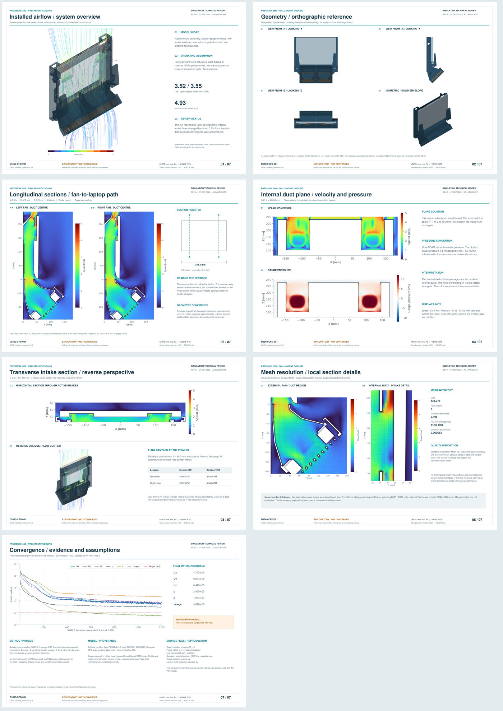

# Installed airflow / technical review

Seven A3 landscape sheets document the first full installed-airflow exploration of the Dell Precision 5560 wall mount. The drawings use the reconstructed iteration-1200 CFD fields and CAD-derived geometry.

[**Open the technical review PDF**](Precision_5560_CFD_Technical_Review.pdf) · [**Download the complete package**](https://github.com/thereprocase/dell-5560-wall-mount/raw/refs/heads/onshape-native-rebuild/docs/simulation/installed-airflow-2026-09-07/Precision_5560_CFD_Drawing_Package.zip)

The ZIP includes the PDF, seven individual 150 dpi PNG sheets and provenance manifests. Views are not to scale; these are simulation review sheets, not fabrication drawings.

| Sheet | Content |
|---|---|
| 01 | Installed system isometric, streamlines and run summary |
| 02 | Independent orthographic views and solid isometric |
| 03 | Left and right longitudinal fan/duct sections and section locator |
| 04 | Internal duct plane: speed and gauge pressure |
| 05 | Transverse intake section, reverse flow view and intake samples |
| 06 | External and internal mesh details with quality disposition |
| 07 | Residual histories, assumptions and provenance |

## What this run establishes

The case contains 836,278 cells in one connected fluid region. BARAM's bundled OpenFOAM v2412 solver completed 1,200 SIMPLE iterations in 1,166 seconds and reconstructed the final fields. The sampled intake flows were 3.520 CFM on the left and 3.546 CFM on the right, less than 0.7% different from their iteration-400 values.

**The run did not meet its 1e-5 residual target.** Stable intake integrals do not establish full field convergence. All four fans use assumed constant-force actuators based on nominal 10 Pa pressure rise. The internal laptop ducts are surrogates; fan curves, grille/fin resistance and thermal loads are not modeled. These values are uncalibrated simulation outputs, not measured hardware performance.

Standard `checkMesh` reported Mesh OK. Expanded checks retained one low-determinant cell and concave/warped-cell diagnostics. No prism layers or mesh-independence demonstration are included. VTK omits cells it cannot contour; plotted gaps are not filled.

## Evidence and reuse

- [Sampled intake and fan flows](flow_samples.json)
- [Cut coordinates, units and final residuals](plot_provenance.json)
- [PDF and source-file hashes](drawing_package_manifest.json)
- [Laptop profile and intake reconstruction](../../../profile_reconstruction.json)
- [Project reference sources](../../../SOURCES.md)

The manifest preserves original workspace-relative source names. Full solver fields, native CAD build tooling and rendering dependencies are not included in this drawing publication. The documents and sheet images can be used independently; reproducing the CFD solve requires those additional inputs. Earlier local `geometry_manifest.json` readiness flags describe preparation-time state, not the completed run.

Revision A, 7 September 2026. This installed 3D case is separate from the repository's earlier sealed 2D plenum study.
