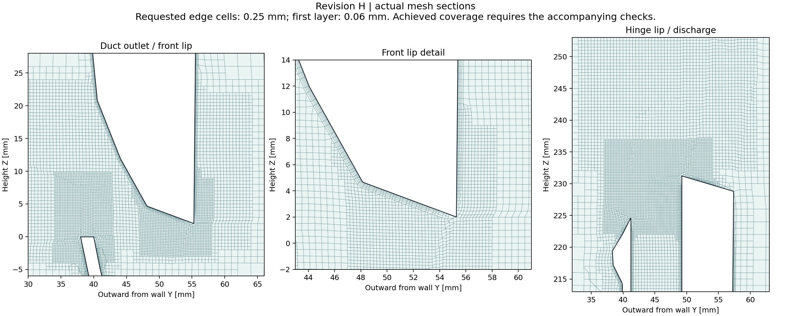

# Revision H / transient airflow verification candidate

Updated 2026-09-08T13:13:06.361174+00:00. This is a new study of the ducted Revision H assembly, separate from the earlier 836,278-cell Revision F exploration and the minimalist design.

| Check | Recorded status |
|---|---|
| Rev H native / STEP geometry | Passed |
| Surface check | complete |
| Mesh phase | complete |
| Volume cells | 18,219,444 |
| Standard / expanded mesh checks | Pass / Pending or failed |
| Diagnostic restart | complete; original 2 ms endpoint not completed |
| Sustained vortex shedding | Not established |
| Laptop-lip suction | Not established |
| Mesh / time-step independence | Not established |
| Hardware validation | Not established |

**Commissioning only.** The standard check passes, but expanded checks find 2,998 low-determinant cells, 78 low-weight faces and 396,528 concave cells. Defects include the lip regions. This mesh has not been accepted for validation. See [quality disposition](quality-disposition.json), [expanded check](mesh-check-expanded.txt) and [defect locations](mesh-defect-locations.json).

The requested local cells are 0.25 mm at selected duct edges and front/hinge lips, with 0.5 mm wake and internal-passage refinement. Five wall layers are requested on printed and laptop surfaces, starting at 0.06 mm. Requested settings must not be mistaken for achieved quality or coverage.

`case-settings.json` records generation-time targets and initial gate flags. The current status, mesh review and check logs contain the achieved evidence.

The transient solver uses an adaptive Courant limit of 0.5, a maximum 25 microsecond step, and second-order momentum/time discretization. The original 2 ms pilot was curtailed; a parallel runtime dictionary-reload error prevented its requested checkpoint. The diagnostic restart targets 0.02 ms with fixed controls and every-step fields, probes and sections. This interval is far too short to establish mature flow or sustained shedding. Actual recorded timestamps and completion status govern interpretation. See the [latest solver log](solver-log.txt) and [restart record](restart-attempt2.json).

All fans remain nominal 10 Pa constant-force actuators. Laptop internals, grille resistance and fan operating points are uncalibrated. There is no temperature prediction. Negative pressure alone is not proof of a Bernoulli mechanism.

- [Machine-readable status](status.json)
- [Case settings and probe coordinates](case-settings.json)
- [Independent Rev H geometry and probe checks](geometry-check.json)
- [Method, acceptance criteria and GPU assessment](METHOD.md)
- [Input hashes](input-hashes.json)
- [Latest pilot diagnostics](pilot-review.json)
- [Plot and animation provenance](animation-provenance.json)
- [Raw probes, local sections and diagnostics](commissioning-samples.zip) ([hashes](sample-hashes.json))

Raw meshes, partitioned fields and unsuccessful trials are retained locally in the CFD worktree. This compact publication does not contain the full solver output.
